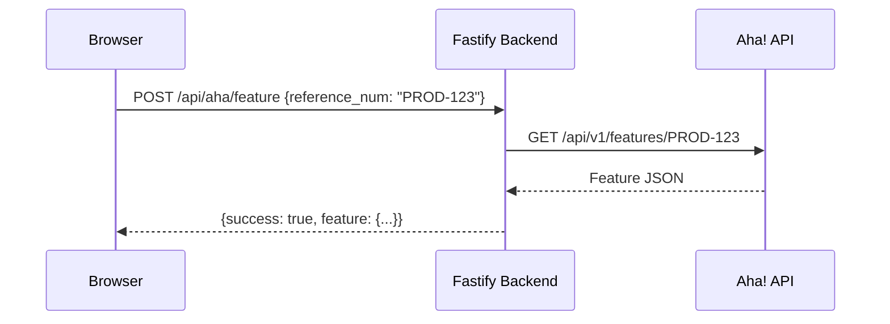

# Aha! Integration

## Overview

The application integrates with [Aha!](https://www.aha.io/) to fetch product roadmap features by reference number. This allows linking Work Items to their corresponding Aha! features for traceability.

## Configuration

Settings are stored under the `aha` key:

| Field | Description |
|-------|-------------|
| `subdomain` | Your Aha! account subdomain (e.g. `your-company` for `your-company.aha.io`) |
| `api_key` | Personal API key (Bearer token) |

Configured in the UI via **Settings > Aha!** tab.

### Obtaining an API Key

1. Log in to your Aha! account.
2. Navigate to **Settings > Account > API** (or visit `https://<subdomain>.aha.io/settings/api_keys`).
3. Generate a new Personal Access Token.

## Endpoints

| Method | Path | Description |
|--------|------|-------------|
| `POST` | `/api/aha/test` | Validates connection by listing features |
| `POST` | `/api/aha/feature` | Fetches a specific feature by `reference_num` |

### Test Connection

Sends a GET request to `https://{subdomain}.aha.io/api/v1/features` with the API key. Returns `{ success: true }` on valid credentials.

### Fetch Feature

Fetches `https://{subdomain}.aha.io/api/v1/features/{reference_num}`. Returns the full Aha! feature object. Returns 404 if the reference number is not found.

## Data Flow

