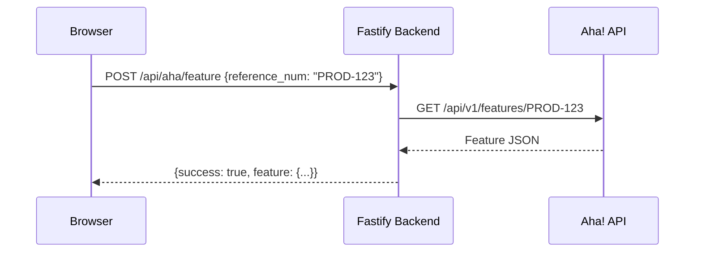

# Aha! Integration

## Overview

The application integrates with [Aha!](https://www.aha.io/) to fetch product roadmap features by reference number. This allows linking Work Items to their corresponding Aha! features for traceability.

## Configuration

Settings are stored under the `aha` key:

| Field | Description |
|-------|-------------|
| `subdomain` | Your Aha! account subdomain (e.g. `your-company` for `your-company.aha.io`) |
| `api_key` | Personal API key (Bearer token) |

Configured in the UI via **Settings > Aha!** tab.

### Obtaining an API Key

1. Log in to your Aha! account.
2. Navigate to **Settings > Account > API** (or visit `https://<subdomain>.aha.io/settings/api_keys`).
3. Generate a new Personal Access Token.

## Endpoints

| Method | Path | Description |
|--------|------|-------------|
| `POST` | `/api/aha/test` | Validates connection by listing features |
| `POST` | `/api/aha/feature` | Fetches a specific feature by `reference_num` |

### Test Connection

Sends a GET request to `https://{subdomain}.aha.io/api/v1/features` with the API key. Returns `{ success: true }` on valid credentials.

### Fetch Feature

Fetches `https://{subdomain}.aha.io/api/v1/features/{reference_num}`. Returns the full Aha! feature object. Returns 404 if the reference number is not found.

## Work Item Link and Ownership

A work item links to an Aha! feature through `links.aha` (an `ExternalLink`):
`key` is the reference number the user typed, `external_id` the Aha! feature id
(set once the feature is synced), and `data` the last synced values (name,
HTML description, Product Value `score`, informational `estimate_mds`,
requirements).

- Once synced (`external_id` set), the work item's **origin** is `aha` and Aha!
  owns its `name` and `description`: the server copies them from the synced data
  on every write and rejects local edits to them. Effort stays local engineering
  data. See [WORKITEMS.md](WORKITEMS.md#origin-and-source-owned-fields).
- **Sync from Aha!** refreshes `links.aha` (keeping the key as typed) and thereby
  the owned fields.
- **Delete** removes the link; the work item keeps its current values and becomes
  `local`.

### Import Matching

**Settings > Aha! > Import** matches each imported feature to an existing work
item by `links.aha.external_id` first, then by an unsynced `links.aha.key`
(case-insensitive). A match gets the refreshed link; an unmatched feature becomes
a new `Backlog` work item with origin `aha`. **Sync all** refreshes every work item
that has a `links.aha.key`.

## Data Flow

```mermaid
sequenceDiagram
    participant UI as Browser
    participant BE as Fastify Backend
    participant Aha as Aha! API

    UI->>BE: POST /api/aha/feature {reference_num: "PROD-123"}
    BE->>Aha: GET /api/v1/features/PROD-123
    Aha-->>BE: Feature JSON
    BE-->>UI: {success: true, feature: {...}}
```
