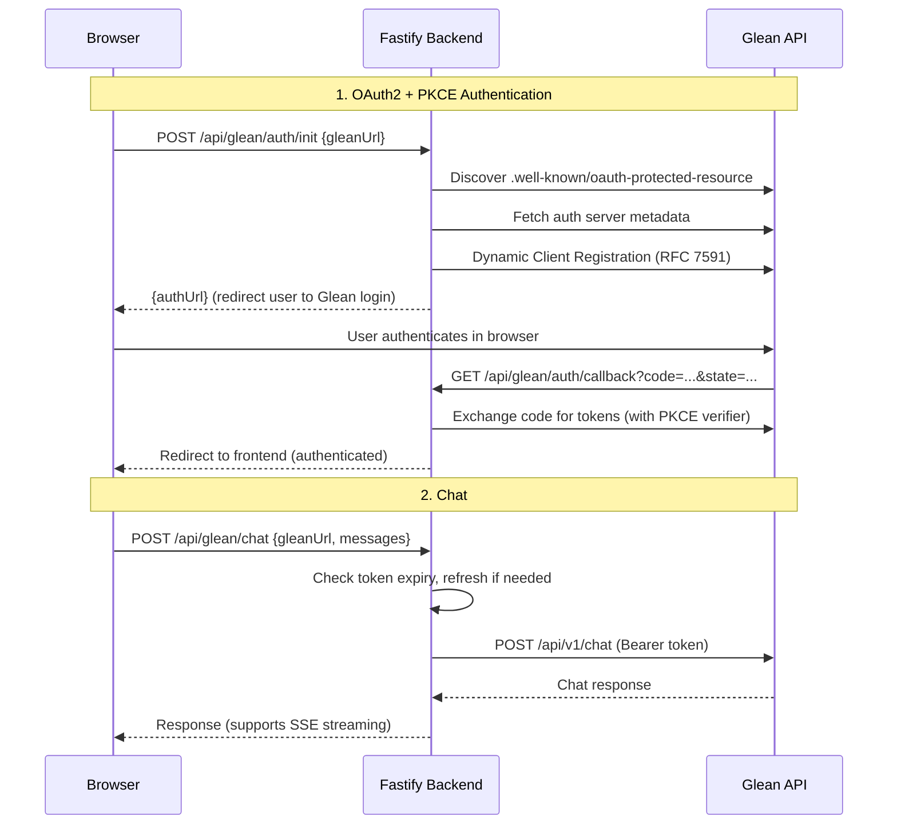

# AI / LLM Integration

## Overview

The application provides a unified AI gateway that supports multiple LLM providers through a single endpoint (`POST /api/llm/generate`). Additionally, Glean has a dedicated OAuth2 integration for knowledge-base chat.

## Configuration

AI settings are stored under the `ai` key in settings:

| Field | Description |
|-------|-------------|
| `provider` | Active provider: `openai`, `gemini`, `augment`, or `glean` |
| `api_key` | API key or session token for the selected provider |
| `model` | Model override (optional; defaults vary per provider) |
| `glean_url` | Glean instance URL (Glean only, e.g. `https://company-be.glean.com`) |

Configured in the UI via **Settings > AI** tab.

## Providers

### OpenAI

- **Endpoint:** `https://api.openai.com/v1/chat/completions`
- **Default model:** `gpt-4-turbo`
- **Auth:** Bearer token via `api_key`

### Google Gemini

- **Endpoint:** `https://generativelanguage.googleapis.com/v1beta/models/{model}:generateContent`
- **Default model:** `gemini-1.5-pro`
- **Auth:** API key passed as query parameter

### Augment (Local CLI)

- **Execution:** Spawns `npx auggie --print --quiet "{prompt}"` as a child process
- **Auth:** `api_key` is set as `AUGMENT_SESSION_AUTH` environment variable
- **Prerequisite:** The `auggie` CLI must be available (installed via npm)

### Glean (Knowledge AI)

Glean uses a separate OAuth2 integration with its own endpoints, rather than the generic `/api/llm/generate` path.

#### Connection Architecture

#### Setup

1. Enter the Glean instance URL in **Settings > AI** (e.g. `https://company-be.glean.com`).
2. Click **Connect to Glean** to initiate the OAuth flow.
3. Authenticate in the browser window that opens.
4. After callback, the status indicator shows "Connected".

#### Environment Variables

| Variable | Default | Description |
|----------|---------|-------------|
| `GLEAN_REDIRECT_BASE_URL` | `http://localhost:4000` | Base URL for OAuth callback |
| `GLEAN_FRONTEND_BASE_URL` | `http://localhost:5173` | Frontend URL to redirect after auth |

#### Token Management

- Tokens (access, refresh, client credentials) are stored encrypted via SecretManager.
- Access tokens are automatically refreshed 60 seconds before expiry.
- If refresh fails, the user must re-authenticate.

#### Key Files

| File | Purpose |
|------|---------|
| `backend/src/routes/glean.ts` | Route aggregator (registers auth + chat routes) |
| `backend/src/routes/gleanAuth.ts` | OAuth2 init, callback, status check |
| `backend/src/routes/gleanChat.ts` | Chat endpoint with token refresh |
| `backend/src/routes/gleanDiscovery.ts` | Metadata discovery and Dynamic Client Registration |
| `backend/src/utils/gleanHelpers.ts` | Token storage, refresh, and API request helpers |

## API Endpoints

See [API Reference > AI / LLM](API-REFERENCE.md#ai--llm) and [API Reference > Glean](API-REFERENCE.md#glean) for the full endpoint listing.
