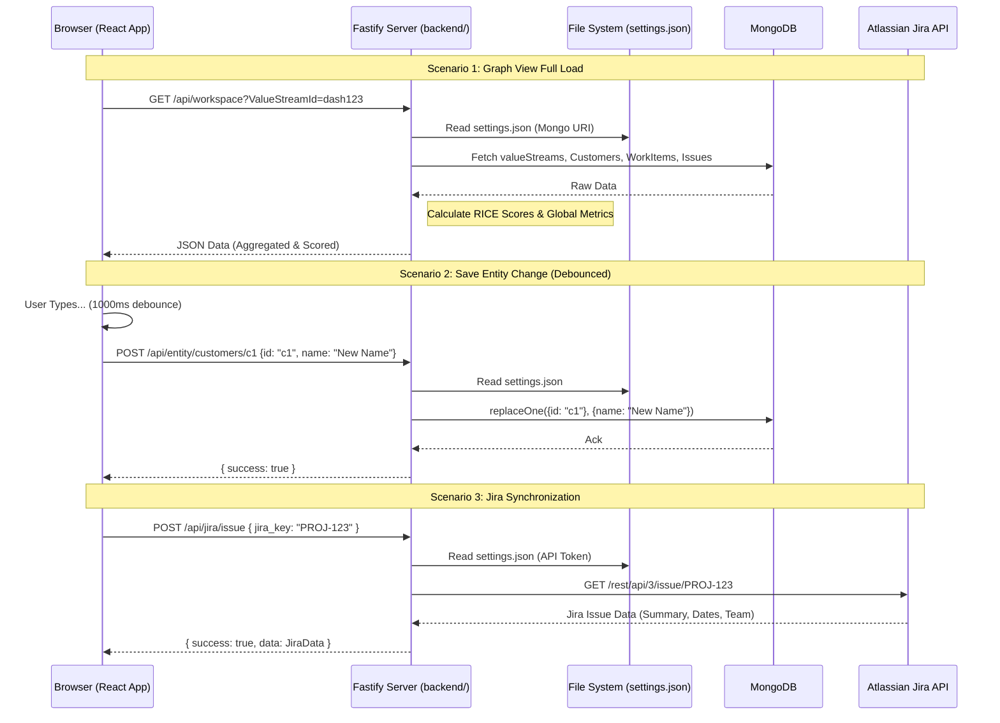

# API Reference

The backend is a standalone Fastify Node.js application running on port 4000. All `/api/*` endpoints (except `/api/auth/login` and `/api/health`) require a `Bearer` token in the `Authorization` header when `ADMIN_SECRET` is set. The Vite dev server proxies `/api` calls to this backend.

Request bodies are validated using `@sinclair/typebox` JSON schemas defined in `backend/src/routes/schemas.ts`, providing both runtime validation (Fastify rejects invalid payloads with 400) and compile-time type safety.

## Health & Authentication

| Method | Path | Description |
|--------|------|-------------|
| `GET` | `/api/health` | Health check (always returns `{ status: "ok" }`) |
| `POST` | `/api/auth/login` | Validates `password` against `ADMIN_SECRET` |

## Settings

| Method | Path | Description |
|--------|------|-------------|
| `GET` | `/api/settings` | Returns full settings with secrets masked as `********` |
| `POST` | `/api/settings` | Updates settings; unmasks unchanged secrets, splits secrets into encrypted store |

See [Secret Management](SECRET-MANAGEMENT.md) for how secrets are stored and masked.

## Core Data

### Workspace (Composite)

| Method | Path | Description |
|--------|------|-------------|
| `GET` | `/api/workspace` | Composite hydration for the Graph View |

**Parameters:** Accepts `?valueStreamId=X`. The backend looks up the ValueStream's saved `parameters` and builds per-collection MongoDB queries via `buildWorkspaceQueries()` (name text, released status, `calculated_score`, minTcv via `$expr`). Cross-entity filters (issue team membership, sprint range) are applied in-memory by `applyValueStreamFilters()`.

**Threshold Protection:** After DB-level and in-memory filtering, returns `413` if the total entity count exceeds the threshold (default: 500).

**Metrics:** `maxScore` and `maxRoi` are computed from pre-computed score fields via `computeMetricsFromPrecomputed()`.

### Granular Collection Endpoints

| Method | Path | Description |
|--------|------|-------------|
| `GET` | `/api/data/customers` | List customers |
| `GET` | `/api/data/workItems` | List work items (reads pre-computed RICE scores from documents) |
| `GET` | `/api/data/issues` | List issues |
| `GET` | `/api/data/teams` | List teams |
| `GET` | `/api/data/sprints` | List sprints |
| `GET` | `/api/data/valueStreams` | List value streams |

**Query Filtering:** All accept query parameters mapped to MongoDB queries via `buildMongoQuery()`:
- **Text filters:** `customerFilter`, `teamFilter`
- **Status filters:** `releasedFilter`
- **Score filters:** `minScoreFilter` (uses pre-computed `calculated_score`)
- **Relational filters:** `customerId`, `workItemId`, `teamId`

Each endpoint is guarded by `fetchWithThreshold()`.

### Score Recomputation

| Method | Path | Description |
|--------|------|-------------|
| `POST` | `/api/data/recomputeScores` | Recomputes and persists `calculated_tcv`, `calculated_effort`, `calculated_score` on all WorkItem documents |

Migration endpoint — run once after deployment to backfill existing data. Scores are also automatically recomputed on every entity save/delete for workItems, customers, and issues.

## Entity CRUD

| Method | Path | Description |
|--------|------|-------------|
| `POST` | `/api/entity/:collection` | Upsert a document (requires `id` in body) |
| `POST` | `/api/entity/:collection/:id` | Upsert a document by path ID |
| `DELETE` | `/api/entity/:collection/:id` | Delete a document with cascade cleanup |

**Allowed collections:** `customers`, `workItems`, `teams`, `issues`, `sprints`, `valueStreams`.

**Cascade cleanup on DELETE:**
- Deleting a **Customer** → `$pull` from `customer_targets` in all WorkItems.
- Deleting a **WorkItem** → `$unset` `work_item_id` from all Issues.
- Deleting a **Team** → clear `team_id` from all Issues.

Returns a `cascaded` object indicating how many related documents were modified.

## Database Management

| Method | Path | Description |
|--------|------|-------------|
| `POST` | `/api/mongo/test` | Validate connectivity to a MongoDB cluster |
| `POST` | `/api/mongo/databases` | List all databases on a cluster |
| `POST` | `/api/mongo/export` | Export entire app database as portable JSON |
| `POST` | `/api/mongo/import` | Wipe and re-populate from a JSON export |
| `POST` | `/api/mongo/query` | Execute raw MongoDB find/aggregate queries |

The test and databases endpoints accept a hierarchical configuration object and connection role (`app` or `customer`). The query endpoint is primarily used for fetching "Customer Custom Data" from secondary clusters.

## Integrations

### Jira

| Method | Path | Description |
|--------|------|-------------|
| `POST` | `/api/jira/test` | Test Jira connection |
| `POST` | `/api/jira/issue` | Fetch a single Jira issue by key |
| `POST` | `/api/jira/search` | Execute a JQL search (max 100 results) |

All endpoints expect Jira configuration (`base_url`, `api_token`, `api_version`) in the request body. See [Jira Integration](JIRA-INTEGRATION.md).

### AI / LLM

| Method | Path | Description |
|--------|------|-------------|
| `POST` | `/api/llm/generate` | Generate text via selected AI provider |

Supports providers: `openai`, `gemini`, `augment`, `glean`. See [AI Integration](AI-INTEGRATION.md).

### Glean

| Method | Path | Description |
|--------|------|-------------|
| `POST` | `/api/glean/auth/init` | Initiate OAuth2 + PKCE flow |
| `GET` | `/api/glean/auth/callback` | OAuth callback handler |
| `GET` | `/api/glean/status` | Check Glean authentication status |
| `POST` | `/api/glean/chat` | Send chat message to Glean (supports streaming) |

See [AI Integration > Glean](AI-INTEGRATION.md#glean-knowledge-ai).

### Aha!

| Method | Path | Description |
|--------|------|-------------|
| `POST` | `/api/aha/test` | Test Aha! connection |
| `POST` | `/api/aha/feature` | Fetch an Aha! feature by reference number |

See [Aha! Integration](AHA-INTEGRATION.md).

### AWS SSO

| Method | Path | Description |
|--------|------|-------------|
| `POST` | `/api/aws/sso/login` | Execute AWS SSO device-code login flow |

Returns the device authorization URL with pre-filled code. After successful login, evicts cached MongoDB clients to force credential refresh. See [Persistence > AWS IAM](PERSISTENCE.md#2-aws-iam).

### LDAP

| Method | Path | Description |
|--------|------|-------------|
| `POST` | `/api/ldap/sync-members` | Query LDAP server for group members |

Accepts `{ ldap_team_name }`, resolves member DNs to `{ name, username }` pairs. See [Teams > LDAP Sync](TEAMS.md#ldap-sync).

## Data Flow

