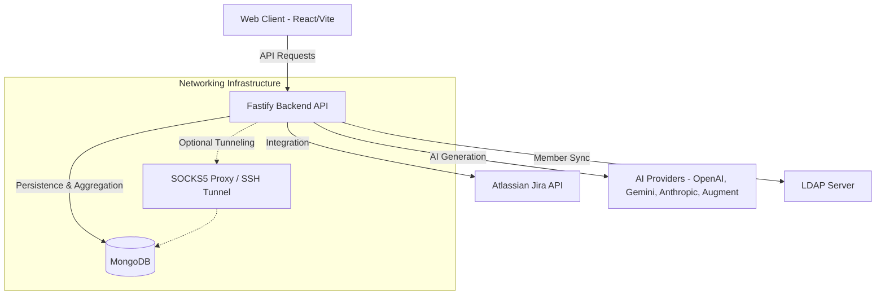
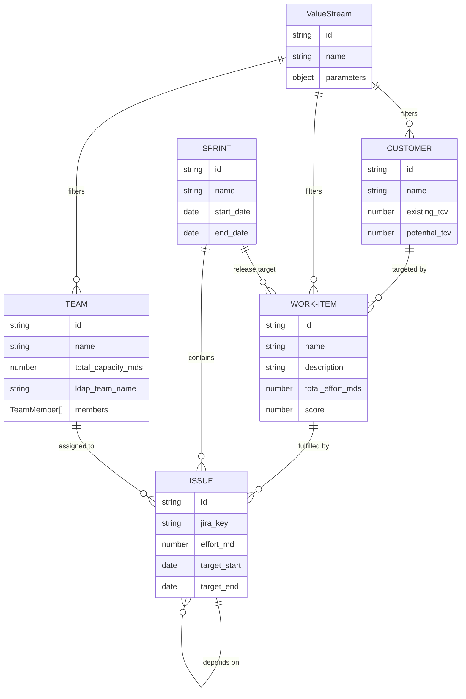

# High-Level Technical Architecture

## Overview

The ValueStream Dependency Tree is a Single Page Application (SPA) designed to visualize the flow of value from customer demand to engineering execution. It uses a custom mathematical layout engine to map entities across a 4-stage pipeline: Customers, Work Items, Teams, and a Gantt Timeline. The system features a robust, standalone Fastify Node.js backend server that supports complex MongoDB aggregations, Jira integrations, and multi-provider AI capabilities.

## System Architecture & Components

### 1. Web Client (Frontend)
- **Framework:** React 19 with Vite (`web-client/` directory).
- **State Management:** Custom `ValueStreamContext` and `useValueStreamData` hook featuring optimistic updates and debounced persistence.
- **Visualization:** `@xyflow/react` (React Flow) for rendering the interactive dependency graph.
- **Layout Engine:** A deterministic engine split across three hooks: `useGraphFilters.ts` (filter/visible set logic), `useGraphBuilder.ts` (coordinate calculation, node/edge construction, highlight application), and `useGraphLayout.ts` (thin orchestrator / public API). Features reachability analysis for hover-based highlighting.

### 2. Backend API (Fastify)
- **Framework:** A standalone Fastify Node.js application (`backend/` directory).
- **Service Layer:** Isolates business logic into `services/` for calculating dynamic RICE scores, effort rollups, and evaluating Sprint capacities.
- **Data Helpers:** `utils/dbHelpers.ts` provides `fetchWithThreshold()` (413 protection per collection), `buildMongoQuery()` (maps query params to MongoDB queries including relational filters), and `applyValueStreamFilters()` (post-scoring hard filters from ValueStream parameters).
- **Schema Validation:** Request bodies are validated using `@sinclair/typebox` JSON schemas defined in `backend/src/routes/schemas.ts`.

### 3. Data & Persistence
- **Database:** MongoDB architecture supporting both primary Application storage and secondary Customer data integration.
- **Connectivity:** Systematic SOCKS5 proxy support for connecting to MongoDB clusters (like Atlas) behind secure SSH bastions.
- **Settings Scope:** Each settings field is assigned a storage scope (`server` or `client`) via a dot-path map in `SETTINGS_SCOPE`. A `partitionSettings()` utility splits updates accordingly. See [Persistence](PERSISTENCE.md#settings-scope-server--client) for details.

### 4. External Integrations
- **Atlassian Jira:** Bidirectional synchronization for Issues, pulling effort, status, and dates.
- **LDAP:** Team member synchronization from LDAP groups. Configured via Settings (LDAP tab). Uses the `ldapts` library to bind, search for groups, and resolve member DNs to name/username pairs.
- **AI Integration:** Multi-provider support for LLMs including OpenAI, Gemini, Anthropic, and localized execution via the Augment (`auggie`) CLI.

## Data Model

The system is composed of several core entities that drive the visualization.

## Data Flow & State Management

The application utilizes a hybrid state management strategy that combines server-side aggregation with client-side optimistic updates.

### 1. Authentication & Security
The system supports an optional security layer via the `ADMIN_SECRET` environment variable.
- **Middleware:** If `ADMIN_SECRET` is set, the Fastify backend hook requires a `Bearer` token in the `Authorization` header for all `/api/*` requests (except login).
- **Frontend Flow:** The `App.tsx` component checks the auth status. If required and not authenticated, it presents the Login Page.
- **Authorized Fetch:** A custom `authorizedFetch` utility centrally manages the injection of the secret and handles session expiration.

### 2. Hydration & Lazy Loading
The frontend employs a sparse-context architecture.
1. **Lazy Granular Fetching:** Top-level components and detail pages only request the specific collections they need. The hook executes `Promise.all` across granular `/api/data/*` endpoints, reducing network payload.
2. **State Merging:** As the user navigates, fetched data is merged into the global `ValueStreamContext`. Previously fetched entities are retained, allowing instant back-navigation.
3. **Composite Graph Loading:** Visual components (like the Gantt tree) that require the entire dataset call a dedicated `/api/workspace` endpoint to hydrate the full dependency tree simultaneously.

### 3. Server-Side Processing
The backend calculates derived data on the fly:
- **Metrics Service:** Joins Work Items with Issues (for effort) and Customers (for TCV) to calculate dynamic RICE scores and return global scaling metadata.
- **Sprint Service:** Sprints are evaluated and tagged with a fiscal quarter based on the application settings.

### 4. Mutations & Reactivity
User actions trigger local state changes via mutation functions:
- **Optimistic Updates:** Immediately execute a local update on the React state array for zero-latency UI feedback.
- **Cascading Deletes:** Referential integrity is enforced **server-side** in `entity.ts`: deleting a Customer `$pull`s targets from Work Items, deleting a Work Item `$unset`s references from Issues, deleting a Team clears `team_id` from Issues. The frontend mirrors these cascades optimistically for instant UI feedback.
- **Debounced Persistence:** Update operations are debounced by 1000ms, bundling rapid changes into a single API call.

For the complete endpoint catalogue and data flow diagrams, see [API Reference](API-REFERENCE.md).

## Core Algorithms & Code Patterns

### 1. The Graph Layout Engine
The core visualization is a highly deterministic layout engine split across `useGraphFilters.ts` (filter logic), `useGraphBuilder.ts` (rendering), and `useGraphLayout.ts` (orchestrator) — not a physics-based graph.
- **Column Mapping:** Establishes fixed X-coordinates forming a left-to-right flow pipeline.
- **Reachability Analysis:** When a node is selected, the engine recursively traces upstream (to root causes) and downstream (to execution) to filter the visible graph to relevant paths.
- **Coordinate Placement:** Dynamically calculates Y offsets so nodes do not overlap, protecting Issue Gantt bars within Team vertical bounds.
- **Holiday-Aware Capacity:** Team capacity is adjusted based on public holidays in the team's configured country.

### 2. Transient UI State Persistence
The application maintains a `uiState` object within the `ValueStreamContext` to persist transient view settings:
- **Scope:** Used by list pages to remember filters, sort orders, and scroll positions.
- **Scroll Restoration:** Implements multi-attempt scroll restoration to ensure the view is correctly applied even if content renders asynchronously.

For deployment options (local, Docker, Kubernetes) and SSH/SOCKS5 networking, see [Deployment & Networking](DEPLOYMENT.md).
