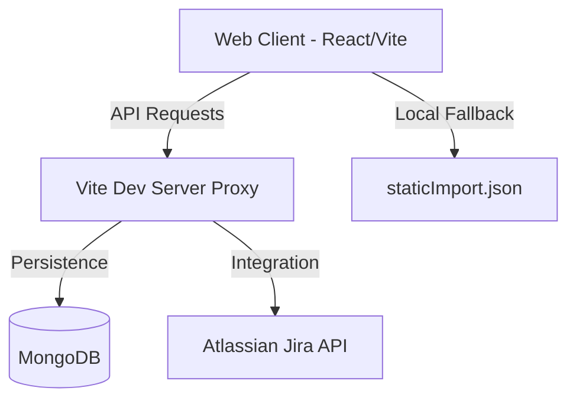
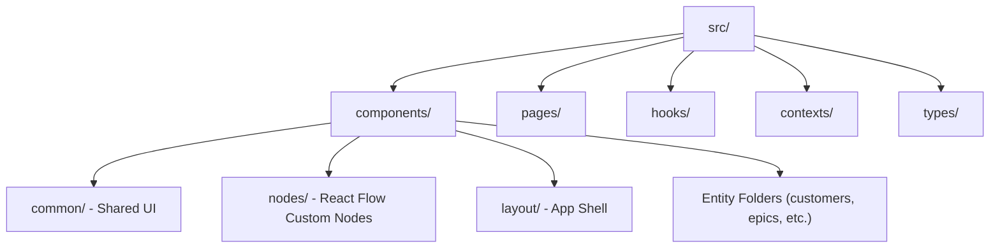
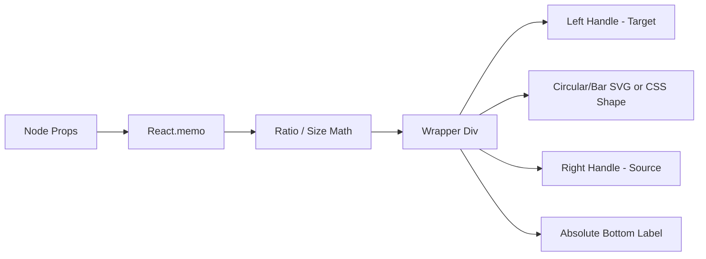

# High-Level Technical Architecture

## Overview
The Value Stream Dependency Tree is a React-based Single Page Application (SPA) designed to visualize the flow of value from customer demand to engineering execution. It uses a custom mathematical layout engine to map entities across a 4-stage pipeline: Customers, Work Items, Teams, and a Gantt Timeline.

## System Components



### 1. Web Client (React + TypeScript)
- **Framework:** React 19 with Vite.
- **State Management:** Custom `DashboardContext` and `useDashboardData` hook.
- **Visualization:** `@xyflow/react` (React Flow) for graph rendering.
- **Layout Engine:** `useGraphLayout.ts` - a deterministic engine that calculates X/Y coordinates based on logical relationships rather than force-directed algorithms.

### 2. Backend & Persistence
- **Mock Persistence Plugin:** A Vite server-side plugin (`vite.config.ts`) that intercepts `/api` calls. It includes a True Backend engine that performs complex data joins and numeric calculations.
- **Database:** MongoDB for persistent storage of all entities. It utilizes MongoDB Aggregation Pipelines for high-performance score calculation.
- **Schema Validation:** Draft-07 JSON schema at `public/schema.json`.
- **Seeding:** Automatically seeds from `public/staticImport.json` if the database is empty.

### 3. Data Flow & Hybrid Filtering
1. **Hydration:** On load or filter change, the client calls `/api/loadData` with optional query parameters (`dashboardId`, `minScore`, etc.).
2. **Server-Side Processing:** The backend fetches data, joins Work Items with Epics to calculate effort, and joins with Customers to calculate RICE scores. It also returns a `metrics` object with global maximums (e.g., `maxScore`) to ensure consistent visual scaling across all filtered views.
3. **Hybrid Filtering:**
    - **Base Filters:** Heavy searches and persistent dashboard parameters are applied at the database level to minimize network payload.
    - **Transient Filters:** Live-typing search in the UI is applied client-side for instantaneous feedback on the already-filtered dataset.
4. **Reactivity:** User actions (updates, deletes, adds) trigger local state changes via hooks, which are then asynchronously persisted via `/api/entity` endpoints.

## Directory Structure



## Architectural Code Patterns

The following patterns outline how components and logic are structurally decoupled across the frontend.

### 1. The Graph Layout Engine (`useGraphLayout.ts`)
The core visualization is not physics-based (like traditional force-directed graphs) but is instead a highly deterministic layout engine.
1. **Column Mapping:** The layout establishes fixed X-coordinates (`COL_CUSTOMER_X`, `COL_WORKITEM_X`, `COL_TEAM_X`) forming a left-to-right flow pipeline.
2. **Hybrid Filtering (Logical AND):** The hook merges Base Parameters (persisted dashboard rules) and Transient Filters (live-typing from the UI) before determining node inclusion.
3. **Array Mutation:** It parses the `data` arrays into valid generic sets (`validCustomers`, `validWorkItems`, `validEpics`).
4. **Coordinate Placement:** It dynamically loops through the sets, generating React Flow nodes (`{ id, position: {x,y}, data }`) and calculating specific Y offsets so nodes do not overlap, particularly protecting Epic Gantt bars within expanding Team vertical bounds.

### 2. React Flow Custom Nodes
The dashboard relies on custom React Flow nodes (`src/components/nodes/`). All nodes follow a specific geometric and mathematical rendering pattern.

**Pattern Template:**
1. **Memoization:** Nodes are always exported wrapped in `React.memo` to prevent unnecessary re-renders during panning/zooming.
2. **Size Calculations:** Node dimensions are dynamically calculated using a base size and a ratio derived from the entity's relative metric weight against a global maximum provided by the backend (e.g., `data.maxScore`, `data.maxTcv`).
3. **Inline Styling:** Most structural, shape, and shadow logic is applied via inline React `style={{}}` objects to support dynamic dimension calculation (`outerSize`, `innerSize`).
4. **Handles:** Invisible `<Handle>` components (from `@xyflow/react`) are positioned absolutely on the left/right edges to allow for programmatic edge connections.



### 3. Data Flow and Context (`useDashboardData.ts`)
The application heavily utilizes `useDashboardData.ts` to manage the global state, fetching, and local optimistic updates.
1.  **Global Provider:** The top-level `App.tsx` calls `useDashboardData()` without filters to hydrate the entire system and injects the resulting `data` and mutation functions into the `DashboardProvider`.
2.  **Dashboard Route Wrapper:** The actual visual Dashboard component calls `useDashboardData(id, filters)` to trigger a server-side filtered re-fetch scoped to a specific dashboard parameter set.
3.  **Local Mutations:** Functions like `addEpic`, `updateWorkItem`, or `deleteCustomer` provided by `useDashboardData` will:
    - Immediately execute an optimistic update on the local React state array.
    - Fire off an asynchronous `fetch` request to the backend `/api/entity/{collection}` endpoints.
    - Not block the UI waiting for the server response (unless explicitly awaited via `.then`).

### 4. Page Component Pattern
Most route-level components in the `src/pages/` and `src/components/{entity}/` directories follow a consistent pattern for handling asynchronous data fetching, loading states, and layout containment.

**Pattern Template:**
```tsx
import React, { useState } from 'react';
import styles from './MyPage.module.css';

interface Props {
    data: DashboardData | null;
    loading: boolean;
    error?: Error | null;
}

export const MyEntityPage: React.FC<Props> = ({ data, loading, error }) => {
    const navigate = useNavigate();
    const [draft, setDraft] = useState<Partial<Entity>>({});

    // Early Returns for Async States
    if (loading) return <div className={styles.pageContainer}>Loading...</div>;
    if (error) return <div className={styles.pageContainer}>Error: {error.message}</div>;
    if (!data) return <div className={styles.pageContainer}>No data available.</div>;

    // Entity Resolution
    const entity = isNew ? draft : data.entities.find(e => e.id === id);
    if (!entity) return <div className={styles.pageContainer}>Not found.</div>;

    return (
        <div className={styles.pageContainer}>
             {/* Header, Forms, Lists */}
        </div>
    );
};
```
*Note: The duplication of this boilerplate across pages is a known technical debt item.*

### 5. ID Generation
When creating new entities (Work Items, Customers, Epics, Sprints), the frontend relies heavily on timestamp-based ID generation concatenated with a prefix character.

**Example Pattern:**
```typescript
const newId = `f${Date.now()}`; // f for Feature/WorkItem
const newEpicId = `e${Date.now()}`; // e for Epic
```

## Deployment Modes

### 1. Standalone (Local Development)
Ideal for individual developers or small teams running everything on a single machine.    
- **Requirements:** Node.js 22+, MongoDB (local or remote).
- **How-to:**
  1. Navigate to the client: `cd web-client`
  2. Install dependencies: `npm install`
  3. Start the server: `npm run dev`
- **Configuration:** Update App Settings to `mongodb://localhost:27017`.

### 2. Docker (Containerized Environment)
Recommended for consistent environments and simplified setup using pre-configured containers.
- **Requirements:** Docker and Docker Compose.
- **How-to:**
  1. From the project root, run: `docker-compose up --build`
  2. Access the app at `http://localhost:5173`.
- **Configuration:** Update App Settings to `mongodb://mongodb:27017` (this utilizes the internal Docker bridge network).

### 3. Kubernetes (Cluster Deployment)
Best for production-grade scaling, high availability, and multi-user environments.        
- **Architecture:** Decoupled Pods for the Web App and MongoDB with automated orchestration.
- **Workflow:**
  1. Build and push the image to a container registry.
  2. Deploy storage and database manifests first.
  3. Deploy the application manifest, ensuring it points to the stable MongoDB service name.

## Logical Blocks
Detailed documentation for each system block:
- [Customers](CUSTOMERS.md)
- [Work Items](WORKITEMS.md)
- [Teams](TEAMS.md)
- [Epics](EPICS.md)
- [Sprints](SPRINTS.md)
- [Dashboards](DASHBOARDS.md)
- [Jira Integration](JIRA_INTEGRATION.md)
- [Persistence & Migration](PERSISTENCE.md)
