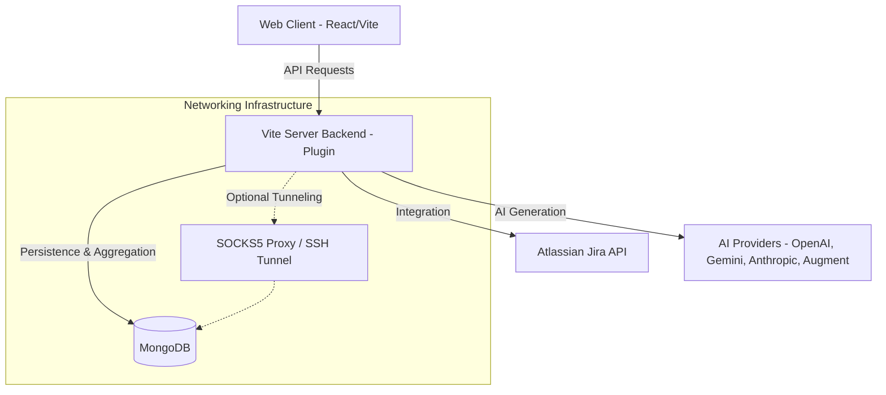
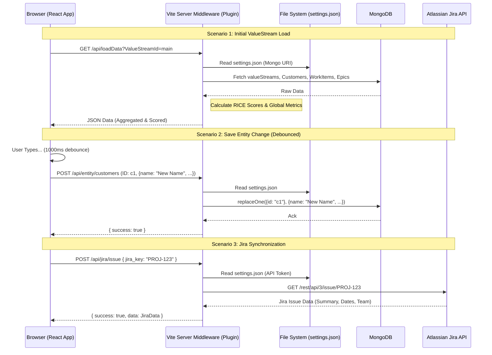
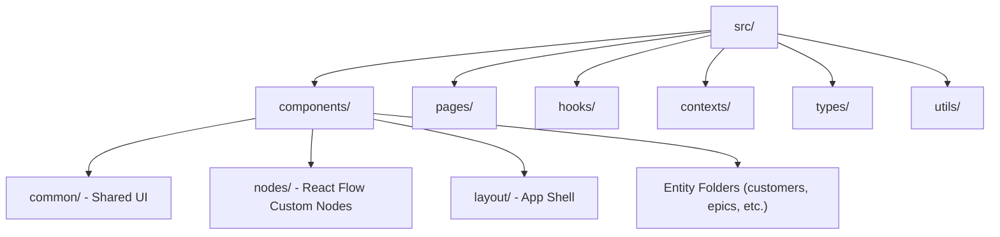
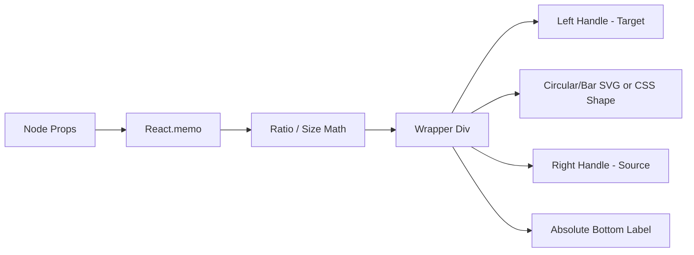
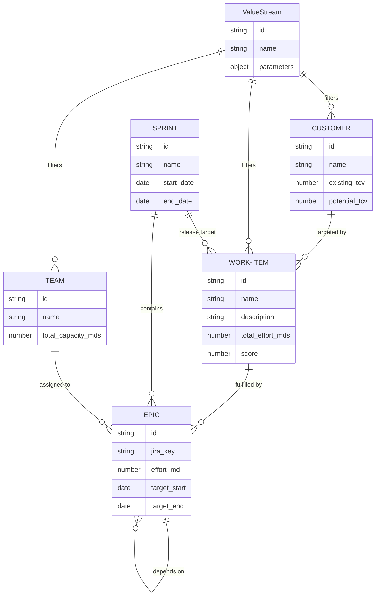

# High-Level Technical Architecture

## Overview
The ValueStream Dependency Tree is a React-based Single Page Application (SPA) designed to visualize the flow of value from customer demand to engineering execution. It uses a custom mathematical layout engine to map entities across a 4-stage pipeline: Customers, Work Items, Teams, and a Gantt Timeline. The system features a robust, embedded backend within the Vite dev server, supporting complex MongoDB aggregations, Jira integrations, and multi-provider AI capabilities.

## System Components



### 1. Web Client (React + TypeScript)
- **Framework:** React 19 with Vite.
- **State Management:** Custom `ValueStreamContext` and `useValueStreamData` hook featuring optimistic updates and debounced persistence.
- **Visualization:** `@xyflow/react` (React Flow) for graph rendering.
- **Layout Engine:** `useGraphLayout.ts` - a deterministic engine that calculates X/Y coordinates based on logical relationships, featuring reachability analysis for hover-based highlighting.

### 2. Backend & Persistence
- **Embedded Backend Plugin:** A Vite server-side plugin (`vite.config.ts`) that handles all `/api` calls. It includes a high-performance engine that performs complex data joins, RICE score calculations, and metrics aggregation.
- **Database Support:** Dual-database architecture supporting both primary Application storage and secondary Customer data integration.
- **Connectivity:** Systematic SOCKS5 proxy support for connecting to MongoDB clusters (like Atlas) behind secure SSH bastions.
- **AI Integration:** Multi-provider support for LLMs including OpenAI, Gemini, Anthropic, and localized execution via the Augment (`auggie`) CLI.
- **Schema Validation:** Draft-07 JSON schema at `public/schema.json`.

## Data Flow & State Management

The application utilizes a hybrid state management strategy that combines server-side aggregation with client-side optimistic updates, primarily orchestrated via the `useValueStreamData.ts` hook.

### 1. Authentication & Authorization
The system supports an optional security layer via the `ADMIN_SECRET` environment variable.
- **Middleware:** If `ADMIN_SECRET` is set, the Vite middleware requires a `Bearer` token in the `Authorization` header for all `/api/*` requests (except `/api/auth/status`).
- **Frontend Flow:** The `App.tsx` component checks the auth status on load. If required and not authenticated, it presents a `LoginPage`.
- **Authorized Fetch:** A custom `authorizedFetch` utility centrally manages the injection of the secret and handles session expiration (401 errors).

### 2. Hydration & Hybrid Filtering
1.  **Global Hydration:** The top-level `App.tsx` calls `useValueStreamData()` without filters to hydrate the entire system and injects the resulting `data` and mutation functions into the `ValueStreamProvider`.
2.  **Scoped Re-fetching:** Visual components (like the ValueStream) call `useValueStreamData(id, filters)` to trigger a server-side filtered re-fetch scoped to specific ValueStream parameters.
3.  **Hybrid Filter Logic:**
    -   **Base Filters:** Heavy searches and persistent ValueStream parameters are applied at the database level to minimize network payload.
    -   **Transient Filters:** Live-typing search in the UI is applied client-side for instantaneous feedback on the already-filtered dataset.

### 3. Server-Side Processing
The backend fetches raw entities and performs the "heavy lifting":
-   **Joins:** It joins Work Items with Epics to calculate effort and with Customers to calculate RICE scores.
-   **Metrics:** It returns a `metrics` object with global maximums (e.g., `maxScore`, `maxRoi`) to ensure consistent visual scaling across all filtered views.
-   **Fiscal Logic:** Sprints are automatically tagged with a fiscal quarter (e.g., `FY2026 Q1`) based on the `general.fiscal_year_start_month` setting.

### 4. AI & LLM Integration
The system provides a unified interface for AI generation, supporting multiple providers:
- **Cloud Providers:** OpenAI (GPT models), Gemini (1.5 Pro/Flash), and Anthropic (Claude).
- **Local Execution:** Integration with the Augment CLI (`auggie`) for localized reasoning and code-aware tasks.
- **Streaming Support:** The API supports Server-Sent Events (SSE) for real-time text generation from OpenAI and Gemini.

### 5. Mutations & Reactivity
User actions (updates, deletes, adds) trigger local state changes via mutation functions (`addEpic`, `updateWorkItem`, etc.) which:
-   **Optimistic Updates:** Immediately execute a local update on the React state array for zero-latency UI feedback.
-   **Cascading Logic:** Deleting a Customer automatically removes it from all Work Item targets; deleting a Team clears associations from its Epics.
-   **Debounced Persistence:** Update operations are debounced by 1000ms. This bundles rapid changes (like typing a description) into a single API call.
-   **Asynchronous Persistence:** Fire off background `fetch` requests (via `authorizedFetch`) to the `/api/entity` endpoints.

### 6. Data Management
- **Export/Import:** The system allows exporting the entire database state to a portable JSON file and importing it back, facilitating environment migration.
- **Query Engine:** A pass-through MongoDB query interface allows for advanced debugging and data exploration directly from the UI.



### 6. Transient UI State Persistence
In addition to server-side data, the application maintains a `uiState` object within the `ValueStreamContext`. This persists transient view settings across navigations within a session:
- **Scope:** Primarily used by `GenericListPage` components to remember filters, sort orders, and scroll positions for each specific `pageId` (e.g., 'support', 'customers').
- **Persistence Mechanism:** The state is kept in-memory within the React context. It ensures that navigating from a list to a detail page and back preserves the user's exact view context.
- **Scroll Restoration:** `GenericListPage` implements a robust, multi-attempt scroll restoration logic to ensure the `scrollTop` is correctly applied even if content renders asynchronously.

## Directory Structure



## Architectural Code Patterns

The following patterns outline how components and logic are structurally decoupled across the frontend.

### 1. The Graph Layout Engine (`useGraphLayout.ts`)
The core visualization is not physics-based (like traditional force-directed graphs) but is instead a highly deterministic layout engine.
1. **Column Mapping:** The layout establishes fixed X-coordinates (`COL_CUSTOMER_X`, `COL_WORKITEM_X`, `COL_TEAM_X`) forming a left-to-right flow pipeline.
2. **Hybrid Filtering (Logical AND):** The hook merges Base Parameters (persisted ValueStream rules) and Transient Filters (live-typing from the UI) before determining node inclusion.
3. **Reachability Analysis:** When a node is selected, the engine performs a recursive trace upstream (to root causes/customers) and downstream (to execution/teams) to filter the visible graph to only show relevant paths.
4. **Coordinate Placement:** It dynamically loops through the sets, generating React Flow nodes and calculating specific Y offsets so nodes do not overlap, particularly protecting Epic Gantt bars within expanding Team vertical bounds.
5. **Holiday-Aware Capacity:** Team capacity for each sprint is automatically adjusted based on public holidays in the team's configured country (using `date-holidays`).

### 2. React Flow Custom Nodes
The ValueStream relies on custom React Flow nodes (`src/components/nodes/`).
- **Progress-Aware Coloring:** Gantt bars are colored based on their temporal relationship to the "Active Sprint" (Slate Blue for past/frozen, Purple for future).
- **Heatmap Intensity:** Gantt segments use heat-mapping to visualize effort intensity relative to a baseline, highlighting over-allocated periods.
- **Memoization:** Nodes are wrapped in `React.memo` to ensure performance during rapid panning.
- **Dynamic Scaling:** Node sizes are scaled linearly between a `baseSize` and `maxSize` using the global metrics provided by the backend.



### 3. Page Component Pattern
Most route-level components in the `src/pages/` and `src/components/{entity}/` directories follow a consistent pattern for handling asynchronous data fetching, loading states, and layout containment.

**Pattern Template:**
```tsx
import React, { useState } from 'react';
import styles from './MyPage.module.css';

interface Props {
    data: ValueStreamData | null;
    loading: boolean;
    error?: Error | null;
}

export const MyEntityPage: React.FC<Props> = ({ data, loading, error }) => {
    const navigate = useNavigate();
    const [draft, setDraft] = useState<Partial<Entity>>({});

    // Early Returns for Async States
    if (loading) return <div className={styles.pageContainer}>Loading...</div>;
    if (error) return <div className={styles.pageContainer}>Error: {error.message}</div>;
    if (!data) return <div className={styles.pageContainer}>No data available.</div>;

    // Entity Resolution
    const entity = isNew ? draft : data.entities.find(e => e.id === id);
    if (!entity) return <div className={styles.pageContainer}>Not found.</div>;

    return (
        <div className={styles.pageContainer}>
             {/* Header, Forms, Lists */}
        </div>
    );
};
```
*Note: The duplication of this boilerplate across pages is a known technical debt item.*

### 4. ID Generation
When creating new entities (Work Items, Customers, Epics, Sprints), the frontend utilizes a secure `generateId` utility (`src/utils/security.ts`). This ensures IDs are globally unique and cryptographically strong, preventing collisions and predictable ID attacks.

**Example Pattern:**
```typescript
const newId = generateId('f'); // f for Feature/WorkItem
const newEpicId = generateId('e'); // e for Epic
```

## Deployment Modes

The application can be deployed in various environments. Security is enforced via the `ADMIN_SECRET` environment variable; if set, the application will require authentication before granting access to data or settings.

### 1. Standalone (Local Development)
Ideal for individual developers or small teams running everything on a single machine.    
- **Requirements:** Node.js 22+, MongoDB (local or remote).
- **How-to:**
  1. Navigate to the client: `cd web-client`
  2. Install dependencies: `npm install`
  3. Set authentication (Optional): `$env:ADMIN_SECRET="your-secure-password"`
  4. Start the server: `npm run dev`
- **Configuration:** 
    - Application settings are stored in `web-client/settings.json` (git-ignored).
    - Update App Settings to `mongodb://localhost:27017` via the UI after login.

### 2. Docker (Containerized Environment)
Recommended for consistent environments and simplified setup using pre-configured containers.
- **Requirements:** Docker and Docker Compose.
- **How-to:**
  1. Define your secrets in a `.env` file in the project root (e.g., `ADMIN_SECRET=prod-secret`).
  2. From the project root, run: `docker-compose up --build`
  3. Access the app at `http://localhost:5173`.
- **Configuration:** Update App Settings to `mongodb://mongodb:27017` (this utilizes the internal Docker bridge network).

### 3. Kubernetes (Cluster Deployment)
Best for production-grade scaling, high availability, and multi-user environments.        
- **Architecture:** Decoupled Pods for the Web App and MongoDB with automated orchestration.
- **Secrets Management:** 
    - Store the `ADMIN_SECRET` in a Kubernetes Secret object and inject it as an environment variable into the app container.
    - Persist the `settings.json` file using a PersistentVolumeClaim (PVC) mounted at the app root to ensure configuration survives pod restarts.
- **Workflow:**
  1. Build and push the image to a container registry.
  2. Deploy storage and database manifests first.
  3. Deploy the application manifest, ensuring it points to the stable MongoDB service name.

## Networking & SSH Tunneling

To support MongoDB clusters (Atlas) behind secure SSH bastions, the application employs a **Systematic SOCKS5 Architecture**.

### 1. SOCKS5 vs. Port Forwarding
Standard SSH Port Forwarding (`-L`) fails with MongoDB SRV records because the driver "leaks" connection attempts to the real hostnames of the cluster members. SOCKS5 (`-D`) solves this by acting as a dynamic proxy that captures all traffic from the driver, including DNS lookups.

### 2. Architecture Patterns

| Environment | Pattern | Implementation |
| :--- | :--- | :--- |
| **Local Dev** | **External Proxy** | Start a tunnel via `./scripts/start-tunnel.ps1` (or `.sh`). |
| **Docker (A)** | **Direct** | Set `SOCKS_PROXY_HOST=` for local/unprotected DBs. |
| **Docker (B)** | **Service Sidecar** | The app connects to the `ssh-proxy` container in the bridge network. |
| **Docker (C)** | **Host Workaround** | The app connects to `host.docker.internal` (Mac/PC host tunnel). |
| **Kubernetes** | **Pod Sidecar** | An SSH container runs alongside the app in the same Pod, sharing `localhost`. |

### 3. Systematic Discovery
The application backend (`web-client/vite.config.ts`) checks for the following environment variables to define the available **Proxy Infrastructure**:
- `SOCKS_PROXY_HOST`: The IP/Hostname of the SOCKS5 proxy.
- `SOCKS_PROXY_PORT`: The port for the external proxy (defaults to `1080`).

#### Granular Opt-In
Setting these environment variables does **not** automatically force all traffic through the proxy. Instead, it enables the capability. Users must explicitly enable the **"Use SOCKS Proxy (from .env)"** checkbox in the Application or Customer MongoDB settings UI to route that specific connection through the tunnel.

This allow for mixed environments (e.g., a local App Mongo container combined with a remote Customer Atlas cluster).

#### The VPN Workaround (Scenario C)
In highly restricted corporate environments, the Docker Desktop VM might be blocked from making outbound SSH connections. In this case, users can establish the SOCKS5 tunnel natively on their host (Mac/PC). The application inside Docker then connects to the host via the special DNS name `host.docker.internal`, effectively routing the database traffic through the host's authenticated SSH session.

If these environment variables are not set, the application attempts a direct connection. This ensures the app logic remains decoupled from the specific tunneling infrastructure.

### 4. MacOS & VPN Tuning (MTU)
Docker Desktop on MacOS frequently experiences packet loss when connecting to SSH bastions over corporate VPNs. The application provides a systematic fix by setting the Docker Network MTU to `1400` in the `docker-compose.yml` to prevent fragmentation.

## Logical Blocks

The system is composed of several core entities. The following Entity Relationship Diagram (ERD) illustrates the data model structure, including key attributes and the cardinality of relationships.



Detailed documentation for each system block:
- [Customers](CUSTOMERS.md)
- [Work Items](WORKITEMS.md)
- [Teams](TEAMS.md)
- [Epics](EPICS.md)
- [Sprints](SPRINTS.md)
- [ValueStreams](VALUESTREAMS.md)
- [Jira Integration](JIRA_INTEGRATION.md)
- [Persistence & Migration](PERSISTENCE.md)

## Theming System

The application features a centralized, CSS-variable-based theming system supporting multiple visual modes.

### 1. Central Palette (`index.css`)
All colors, shadows, and interactive states are defined using CSS variables in `src/index.css`.
- **Default (Dark Mode):** Variables are defined under `:root`.
- **Filips Mode:** A "muted dim" pastel theme defined under the `[data-theme='filips']` selector. This theme uses soft slate-grey backgrounds and more defined, high-contrast text and node colors for readability.

### 2. Application Logic
- **State:** The user's theme choice is stored in the `general.theme` setting ('dark' or 'filips').
- **Injection:** The `App.tsx` component monitors this setting and applies the corresponding `data-theme` attribute to the `document.documentElement`.
- **Global Styles:** All components and CSS modules reference the central variables (e.g., `var(--bg-primary)`, `var(--text-highlight)`), ensuring the theme choice is obeyed system-wide without local color overrides.

### 3. Caching & Performance
To prevent a "flash of dark theme" during page reloads:
- **LocalStorage Sync:** The `useValueStreamData` hook automatically caches the user's theme choice in `localStorage` (`vst-theme`).
- **Pre-render Initialization:** An inline script in `index.html` checks `localStorage` and applies the theme attribute *before* the React application initializes, ensuring a seamless visual experience.
