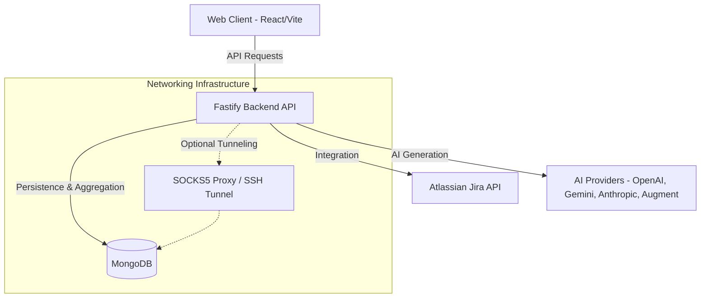
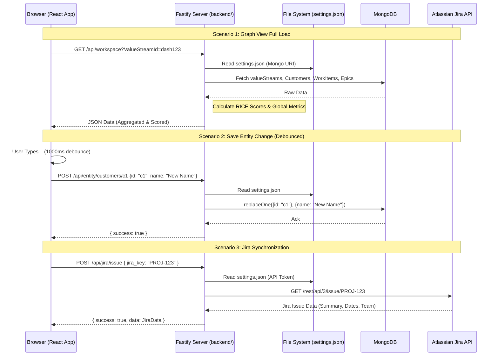
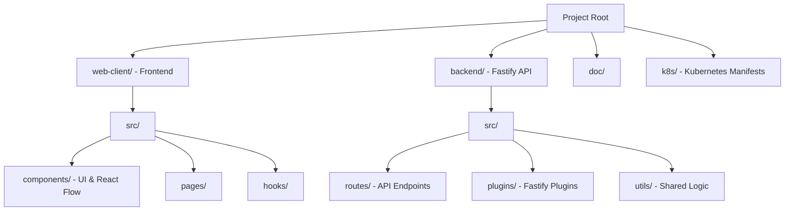
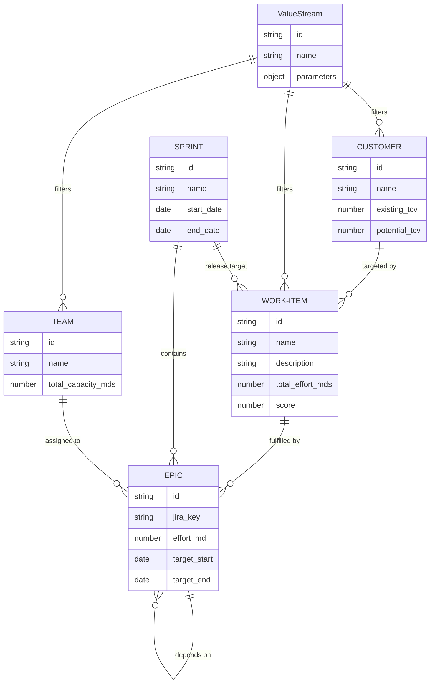

# High-Level Technical Architecture

## Overview
The ValueStream Dependency Tree is a React-based Single Page Application (SPA) designed to visualize the flow of value from customer demand to engineering execution. It uses a custom mathematical layout engine to map entities across a 4-stage pipeline: Customers, Work Items, Teams, and a Gantt Timeline. The system features a robust, standalone Fastify Node.js backend server that supports complex MongoDB aggregations, Jira integrations, and multi-provider AI capabilities.

## System Components

### 1. Web Client (React + TypeScript)
- **Framework:** React 19 with Vite.
- **State Management:** Custom `ValueStreamContext` and `useValueStreamData` hook featuring optimistic updates and debounced persistence.
- **Visualization:** `@xyflow/react` (React Flow) for graph rendering.
- **Layout Engine:** `useGraphLayout.ts` - a deterministic engine that calculates X/Y coordinates based on logical relationships, featuring reachability analysis for hover-based highlighting.

### 2. Backend & Persistence
- **Standalone Node.js Backend:** A Fastify-based application (`backend/`) that handles all `/api` calls. It includes high-performance routes and utilities that perform complex data joins, RICE score calculations, and metrics aggregation.
- **Database Support:** Dual-database architecture supporting both primary Application storage and secondary Customer data integration.
- **Connectivity:** Systematic SOCKS5 proxy support for connecting to MongoDB clusters (like Atlas) behind secure SSH bastions.
- **AI Integration:** Multi-provider support for LLMs including OpenAI, Gemini, Anthropic, and localized execution via the Augment (`auggie`) CLI.
- **Schema Validation:** Draft-07 JSON schema at `web-client/public/schema.json` and Fastify JSON schemas for API payload validation.

## Data Flow & State Management

The application utilizes a hybrid state management strategy that combines server-side aggregation with client-side optimistic updates, primarily orchestrated via the `useValueStreamData.ts` hook.

### 1. Authentication & Authorization
The system supports an optional security layer via the `ADMIN_SECRET` environment variable.
- **Middleware:** If `ADMIN_SECRET` is set, the Fastify backend hook (`backend/src/plugins/auth.ts`) requires a `Bearer` token in the `Authorization` header for all `/api/*` requests (except `/api/auth/login`).
- **Frontend Flow:** The `App.tsx` component checks the auth status on load. If required and not authenticated, it presents a `LoginPage`.
- **Authorized Fetch:** A custom `authorizedFetch` utility centrally manages the injection of the secret and handles session expiration (401 errors).

### 2. Hydration & Lazy Loading
The frontend employs a sparse-context architecture via `useValueStreamData`.
1.  **Lazy Granular Fetching:** Top-level components and detail pages only request the specific collections they need (e.g., `useValueStreamData(id, filters, 1000, showAlert, ['customers'])`). The hook executes `Promise.all` across granular `/api/data/*` endpoints, reducing network payload and server load.
2.  **State Merging:** As the user navigates, fetched data is merged into the global `ValueStreamContext`. Previously fetched entities are not wiped out, allowing instant back-navigation.
3.  **Composite Graph Loading:** Visual components (like the Gantt tree) that require the entire dataset call a dedicated `/api/workspace` endpoint to hydrate the full dependency tree simultaneously.

### 3. Server-Side Processing (Service Layer)
The Fastify backend isolates business logic into a dedicated `services/` directory:
-   **Metrics Service:** When Work Items or the full workspace are requested, the server internally joins Work Items with Epics (for effort) and Customers (for TCV) to calculate dynamic RICE scores and return global scaling metadata (`maxScore`, `maxRoi`).
-   **Sprint Service:** Sprints are automatically evaluated and tagged with a fiscal quarter (e.g., `FY2026 Q1`) based on the `general.fiscal_year_start_month` setting before being served.

### 4. AI & LLM Integration
The system provides a unified interface for AI generation, supporting multiple providers:
- **Cloud Providers:** OpenAI (GPT models), Gemini (1.5 Pro/Flash), and Anthropic (Claude).
- **Local Execution:** Integration with the Augment CLI (`auggie`) for localized reasoning and code-aware tasks.

### 5. Mutations & Reactivity
User actions (updates, deletes, adds) trigger local state changes via mutation functions (`addEpic`, `updateWorkItem`, etc.) which:
-   **Optimistic Updates:** Immediately execute a local update on the React state array for zero-latency UI feedback.
-   **Cascading Logic:** Deleting a Customer automatically removes it from all Work Item targets; deleting a Team clears associations from its Epics.
-   **Debounced Persistence:** Update operations are debounced by 1000ms. This bundles rapid changes (like typing a description) into a single API call.
-   **Asynchronous Persistence:** Fire off background `fetch` requests (via `authorizedFetch`) to the `/api/entity` endpoints.

### 6. Data Management
- **Export/Import:** The system allows exporting the entire database state to a portable JSON file and importing it back, facilitating environment migration.
- **Query Engine:** A pass-through MongoDB query interface allows for advanced debugging and data exploration directly from the UI.

### 7. Transient UI State Persistence
In addition to server-side data, the application maintains a `uiState` object within the `ValueStreamContext`. This persists transient view settings across navigations within a session:
- **Scope:** Primarily used by `GenericListPage` components to remember filters, sort orders, and scroll positions for each specific `pageId` (e.g., 'support', 'customers').
- **Persistence Mechanism:** The state is kept in-memory within the React context. It ensures that navigating from a list to a detail page and back preserves the user's exact view context.
- **Scroll Restoration:** `GenericListPage` implements a robust, multi-attempt scroll restoration logic to ensure the `scrollTop` is correctly applied even if content renders asynchronously.

## Directory Structure

## Architectural Code Patterns

The following patterns outline how components and logic are structurally decoupled across the frontend.

### 1. The Graph Layout Engine (`useGraphLayout.ts`)
The core visualization is not physics-based (like traditional force-directed graphs) but is instead a highly deterministic layout engine.
1. **Column Mapping:** The layout establishes fixed X-coordinates (`COL_CUSTOMER_X`, `COL_WORKITEM_X`, `COL_TEAM_X`) forming a left-to-right flow pipeline.
2. **Hybrid Filtering (Logical AND):** The hook merges Base Parameters (persisted ValueStream rules) and Transient Filters (live-typing from the UI) before determining node inclusion.
3. **Reachability Analysis:** When a node is selected, the engine performs a recursive trace upstream (to root causes/customers) and downstream (to execution/teams) to filter the visible graph to only show relevant paths.
4. **Coordinate Placement:** It dynamically loops through the sets, generating React Flow nodes and calculating specific Y offsets so nodes do not overlap, particularly protecting Epic Gantt bars within expanding Team vertical bounds.
5. **Holiday-Aware Capacity:** Team capacity for each sprint is automatically adjusted based on public holidays in the team's configured country (using `date-holidays`).

### 2. React Flow Custom Nodes
The ValueStream relies on custom React Flow nodes (`web-client/src/components/nodes/`).
- **Progress-Aware Coloring:** Gantt bars are colored based on their temporal relationship to the "Active Sprint" (Slate Blue for past/frozen, Purple for future).
- **Heatmap Intensity:** Gantt segments use heat-mapping to visualize effort intensity relative to a baseline, highlighting over-allocated periods.
- **Memoization:** Nodes are wrapped in `React.memo` to ensure performance during rapid panning.
- **Dynamic Scaling:** Node sizes are scaled linearly between a `baseSize` and `maxSize` using the global metrics provided by the backend.

### 3. Page Component Pattern
Most route-level components in the `web-client/src/pages/` and `web-client/src/components/{entity}/` directories follow a consistent pattern for handling asynchronous data fetching, loading states, and layout containment.

### 4. ID Generation
When creating new entities, the frontend utilizes a secure `generateId` utility (`web-client/src/utils/security.ts`). This ensures IDs are globally unique and cryptographically strong.

## Deployment Modes

The application can be deployed in various environments. Security is enforced via the `ADMIN_SECRET` environment variable.

### 1. Standalone (Local Development)
Ideal for individual developers or small teams running everything on a single machine.    
- **Requirements:** Node.js 22+, MongoDB (local or remote).
- **How-to:**
  1. Install dependencies at the root: `npm install`
  2. Start both the Fastify backend and Vite frontend concurrently: `npm run dev`
  3. The frontend will be available at `http://localhost:5173`, proxying `/api` to the backend at `http://localhost:3000`.

### 2. Docker (Containerized Environments)
Recommended for consistent environments.

**Development (`docker-compose.yml`):**
Uses Vite dev server with hot-reloading.
- **How-to:** `docker-compose up --build`
- **Access:** `http://localhost:5173`

**Production (`docker-compose.prod.yml`):**
Uses a multi-stage build to compile the React app and serve it statically via an **Nginx** web server, which also natively reverse-proxies `/api` requests to the Fastify container.
- **How-to:** `docker-compose -f docker-compose.prod.yml up --build -d`
- **Access:** `http://localhost:80`

### 3. Kubernetes (Cluster Deployment)
Best for production-grade scaling, high availability, and multi-user environments. Manifests are provided in the `k8s/` directory.
- **Architecture:** Decoupled Pods for the Nginx Web Client, Fastify Backend, and MongoDB.
- **Secrets Management:** The `ADMIN_SECRET` is managed via a Kubernetes Secret object and injected as an environment variable into the backend pod.
- **Workflow:**
  1. `kubectl apply -f k8s/secrets.example.yaml`
  2. `kubectl apply -f k8s/mongodb.yaml`
  3. `kubectl apply -f k8s/backend.yaml`
  4. `kubectl apply -f k8s/web-client.yaml`

## Networking & SSH Tunneling

To support MongoDB clusters (Atlas) behind secure SSH bastions, the application employs a **Systematic SOCKS5 Architecture**.

### 1. SOCKS5 vs. Port Forwarding
Standard SSH Port Forwarding (`-L`) fails with MongoDB SRV records because the driver "leaks" connection attempts to the real hostnames of the cluster members. SOCKS5 (`-D`) solves this by acting as a dynamic proxy that captures all traffic from the driver.

### 2. Architecture Patterns

| Environment | Pattern | Implementation |
| :--- | :--- | :--- |
| **Local Dev** | **External Proxy** | Start a tunnel via `./scripts/start-tunnel.ps1`. Backend picks up env vars. |
| **Docker (A)** | **Direct** | Set `SOCKS_PROXY_HOST=` for local/unprotected DBs. |
| **Docker (B)** | **Service Sidecar** | The backend connects to the `ssh-proxy` container in the bridge network. |
| **Docker (C)** | **Host Workaround** | The backend connects to `host.docker.internal` (Mac/PC host tunnel). |
| **Kubernetes** | **Pod Sidecar** | An SSH container runs alongside the backend in the same Pod. |

### 3. Systematic Discovery
The backend checks for the following environment variables to define the available **Proxy Infrastructure**:
- `SOCKS_PROXY_HOST`: The IP/Hostname of the SOCKS5 proxy.
- `SOCKS_PROXY_PORT`: The port for the external proxy (defaults to `1080`).

#### Granular Opt-In
Setting these environment variables does **not** automatically force all traffic through the proxy. Users must explicitly enable the **"Use SOCKS Proxy"** checkbox in the MongoDB settings UI to route that specific connection through the tunnel.

## Logical Blocks

The system is composed of several core entities. The following Entity Relationship Diagram (ERD) illustrates the data model structure.

