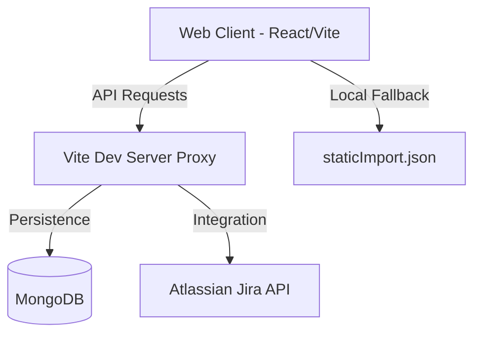

# High-Level Technical Architecture

## Overview
The Value Stream Dependency Tree is a React-based Single Page Application (SPA) designed to visualize the flow of value from customer demand to engineering execution. It uses a custom mathematical layout engine to map entities across a 4-stage pipeline: Customers, Work Items, Teams, and a Gantt Timeline.

## System Components

### 1. Web Client (React + TypeScript)
- **Framework:** React 19 with Vite.
- **State Management:** Custom `DashboardContext` and `useDashboardData` hook.
- **Visualization:** `@xyflow/react` (React Flow) for graph rendering.
- **Layout Engine:** `useGraphLayout.ts` - a deterministic engine that calculates X/Y coordinates based on logical relationships rather than force-directed algorithms.

### 2. Backend & Persistence
- **Mock Persistence Plugin:** A Vite server-side plugin (`vite.config.ts`) that intercepts `/api` calls.
- **Database:** MongoDB for persistent storage of all entities.
- **Schema Validation:** Draft-07 JSON schema at `public/schema.json`.
- **Seeding:** Automatically seeds from `public/staticImport.json` if the database is empty.

### 3. Data Flow
1. **Hydration:** On load, the client calls `/api/loadData`. The Vite proxy fetches from Mongo, applies any migrations (like sprint quarter recomputation), and returns the full `DashboardData` object.
2. **Reactivity:** User actions (updates, deletes, adds) trigger local state changes via hooks, which are then asynchronously persisted via `/api/entity` endpoints.
3. **Prioritization:** The RICE score for Work Items is calculated on-the-fly in the client whenever Customer TCV or Work Item Effort changes.

## Deployment Modes

### 1. Standalone (Local Development)
Ideal for individual developers or small teams running everything on a single machine.
- **Requirements:** Node.js 22+, MongoDB (local or remote).
- **How-to:**
  1. Navigate to the client: `cd web-client`
  2. Install dependencies: `npm install`
  3. Start the server: `npm run dev`
- **Configuration:** Update App Settings (⚙️) to `mongodb://localhost:27017`.

### 2. Docker (Containerized Environment)
Recommended for consistent environments and simplified setup using pre-configured containers.
- **Requirements:** Docker and Docker Compose.
- **How-to:**
  1. From the project root, run: `docker-compose up --build`
  2. Access the app at `http://localhost:5173`.
- **Configuration:** Update App Settings (⚙️) to `mongodb://mongodb:27017` (this utilizes the internal Docker bridge network).

### 3. Kubernetes (Cluster Deployment)
Best for production-grade scaling, high availability, and multi-user environments.
- **Architecture:** Decoupled Pods for the Web App and MongoDB with automated orchestration.
- **Key Components:**
  - **PersistentVolumeClaim (PVC):** Essential for persisting MongoDB data across pod restarts.
  - **Internal Service (ClusterIP):** Provides a stable DNS name (`mongodb`) for the app to reach the database.
  - **External Access:** Expose the Vite dev server via a `LoadBalancer` Service or an `Ingress Controller`.
- **Workflow:**
  1. Build and push the image to a container registry: `docker build -t <registry>/valuestream-tree:latest ./web-client`
  2. Deploy storage and database manifests first.
  3. Deploy the application manifest, ensuring it points to the stable MongoDB service name.

## Logical Blocks
Detailed documentation for each system block:
- [Customers](CUSTOMERS.md)
- [Work Items](WORKITEMS.md)
- [Teams](TEAMS.md)
- [Epics](EPICS.md)
- [Sprints](SPRINTS.md)
- [Dashboards](DASHBOARDS.md)
- [Jira Integration](JIRA_INTEGRATION.md)
- [Persistence & Migration](PERSISTENCE.md)
