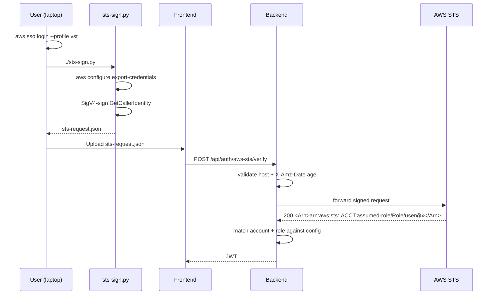

# Authentication & Authorization

## Overview

The application supports five authentication methods, configurable via the **Settings > Authentication** tab. All methods issue JWT tokens for session management. Authorization is role-based, managed locally in MongoDB regardless of the auth source.

## Authentication Methods

### 1. Local (`local`)

Username/password accounts stored in the `users` MongoDB collection. Passwords are hashed with bcrypt (12 rounds).

**Setup:**
1. Set `ADMIN_SECRET` in `.env`
2. Call `POST /api/auth/setup` with Bearer token = ADMIN_SECRET to create the first admin user
3. Subsequent users can be managed via the Settings > Authentication > Users table

### 2. LDAP Bind (`ldap`)

Authenticates against the LDAP server configured in **Settings > LDAP**. The flow:
1. Backend binds with the service account (Bind DN from LDAP settings)
2. Searches for the user by `uid`, `sAMAccountName`, or `cn`
3. Attempts to bind as the found user with the submitted password
4. On success, creates/updates a local user record (auto-provisioned)

Roles are managed locally — LDAP only provides identity, not authorization.

### 3. AWS SSO (`aws-sso`)

Uses the AWS SSO OIDC device authorization flow to authenticate users. No AWS admin or Okta admin involvement required — the APIs are public/unauthenticated.

**Configuration** (Settings > Authentication > AWS SSO Configuration):
- **SSO Start URL** — e.g. `https://my-company.awsapps.com/start`
- **AWS Region** — e.g. `us-east-1`
- **Account ID** — the AWS account users must have access to
- **Role Name** — the IAM role they must be able to assume

**Flow:**
```
Frontend                     Backend                      AWS
   │                            │                           │
   │──POST /auth/aws-sso/start─▶│                           │
   │                            │──RegisterClient──────────▶│
   │                            │◀─clientId/secret──────────│
   │                            │──StartDeviceAuth─────────▶│
   │                            │◀─deviceCode, URL──────────│
   │◀──verification_url─────────│                           │
   │                            │                           │
   │──opens URL in browser──────────────────────────────────▶│ (user authenticates via Okta)
   │                            │                           │
   │──POST /auth/aws-sso/poll──▶│                           │
   │                            │──CreateToken─────────────▶│
   │                            │◀─accessToken──────────────│
   │                            │──GetRoleCredentials──────▶│
   │                            │◀─tempCreds────────────────│
   │                            │──STS.GetCallerIdentity───▶│
   │                            │◀─ARN (user identity)──────│
   │◀──JWT token────────────────│                           │
```

The user's identity (email/username) is extracted from the STS ARN. The backend creates/updates a local user record on first login.

**Why this works without admin involvement:**
- `RegisterClient` and `StartDeviceAuthorization` are unauthenticated AWS APIs
- The user authenticates through their existing IdP (Okta) in the browser
- If the user can assume the configured role, they're authorized
- Each login session is fully isolated (in-memory, per-request)

### 4. AWS STS Pre-signed (`aws-sts`)

Designed for deployments where the backend has **no AWS connectivity** (e.g. running in a non-AWS
Kubernetes cluster). Instead of the backend discovering the user's identity by calling AWS, the
user signs a `sts:GetCallerIdentity` request on their own machine and uploads the signed payload.
The backend simply forwards the signed bytes to STS and reads back the verified ARN.

**Configuration** (Settings > Authentication > AWS STS Configuration):
- **AWS Region** — e.g. `us-west-2`; must match the STS endpoint the helper signs for.
- **Account ID** — only callers from this account are accepted.
- **Allowed Role Name** — only assumed-role ARNs with this role name are accepted.
  For AWS Identity Center (SSO) sessions, STS returns the role wrapped as
  `AWSReservedSSO_<PermissionSetName>_<16-hex-hash>`; configure the
  permission-set name (e.g. `CustomPowerUserAccess`) and the backend matches
  either the literal role name or the extracted permission-set name.
- **Default AWS Profile** — baked into the downloadable helper script so users can run it with
  no flags.
- **Max request age (seconds)** — default 300. Rejects signed requests older than this to limit
  replay window.

**Flow:**



**Why this works without backend AWS access:**
- The backend never holds AWS credentials and never calls AWS with its own identity; it only
  forwards the opaque signed bytes over plain HTTPS.
- STS itself validates the signature. An invalid signature returns 403 and the backend rejects
  the login.
- The `X-Amz-Date` freshness check plus the short 15-minute SigV4 validity window limit replay.
- The account + role check ensures only the configured role (from the configured account) is
  allowed in, regardless of what other AWS roles the user can assume.

**Helper script (`scripts/sts-sign.py`):**
- Pure Python 3 stdlib — no `pip install` needed.
- Shells out to `aws configure export-credentials --profile <p>` (AWS CLI v2.9+) to obtain
  short-lived credentials for any profile type (SSO, role, static).
- If credentials are missing or expired (SSO session elapsed), automatically runs
  `aws sso login --profile <p>` and retries. Pass `--no-login` to disable.
- Signs the request with inline SigV4 (`hmac` + `hashlib`).
- Writes `sts-request.json` by default; `--stdout` pipes to stdout; `--output` overrides the path.
- `--profile` and `--region` override the baked-in defaults; otherwise it uses whatever the
  admin configured in Settings. When no default is configured it falls back to `$AWS_PROFILE`
  then the `default` profile.

### 5. Okta OIDC (`okta`)

Standard OAuth2/OIDC authorization code flow with PKCE against an Okta tenant. **Requires an Okta admin** to register the application.

**Configuration** (Settings > Authentication > Okta Configuration):
- **Issuer URL** — e.g. `https://yourcompany.okta.com`
- **Client ID** — from Okta app registration
- **Client Secret** — optional (only for confidential clients; PKCE works without it)

**Okta Admin Setup:**
1. Create an **OIDC Web Application** in Okta
2. Set sign-in redirect URI: `https://<your-app>/api/auth/okta/callback`
3. Grant type: Authorization Code
4. Scopes: `openid`, `profile`, `email`
5. Assign users/groups to the application

**Flow:**
```
User clicks "Login with Okta"
  → Redirect to GET /api/auth/okta/login
  → Backend discovers Okta endpoints via .well-known/openid-configuration
  → Redirect to Okta authorization endpoint (with PKCE challenge)
  → User authenticates in Okta (via Okta login or existing SSO session)
  → Okta redirects to /api/auth/okta/callback with auth code
  → Backend exchanges code for tokens (with PKCE verifier)
  → Extracts identity from ID token (email, name)
  → Creates/updates local user, issues JWT
  → Redirects to frontend with ?auth_token=<jwt>
```

**Environment variables:**
- `OKTA_REDIRECT_BASE_URL` — Backend base URL for callbacks (defaults to `GLEAN_REDIRECT_BASE_URL` or `http://localhost:4000`)
- `OKTA_FRONTEND_BASE_URL` — Frontend URL for post-auth redirect (defaults to `GLEAN_FRONTEND_BASE_URL` or `http://localhost:5173`)

## Authorization

### Roles

| Role | Permissions |
|------|------------|
| `viewer` | Read all data, change client-side settings (e.g. theme) |
| `editor` | + create, edit, delete entities (customers, work items, issues, teams, sprints) |
| `admin` | + server settings, user management, integration configuration |

### Role Assignment

- **First user:** Created via `POST /api/auth/setup` with `admin` role
- **LDAP/AWS SSO/Okta users:** Auto-created with the configured default role (Settings > Authentication > Default role)
- **Role changes:** Admin can change any user's role in Settings > Authentication > Users

### Enforcement

- **Backend:** `requireRole(request, minRole)` utility checks `request.authUser.role` against a hierarchy (`viewer < editor < admin`)
- **Protected routes:**
  - `POST /api/settings` — requires `admin`
  - `POST/DELETE /api/entity/*` — requires `editor`
  - `GET /api/*` — requires `viewer` (any authenticated user)
  - Integration routes (Jira, Aha, LDAP sync) — require `admin`

### ADMIN_SECRET (God Mode)

The `ADMIN_SECRET` environment variable serves as a superuser bypass:
- Accepted as a Bearer token on any endpoint
- Grants `admin` role
- Required for initial user setup
- Intended for bootstrap and emergency access — can be removed once users are configured

#### Admin-password brute-force lockout

The legacy admin-password login (`POST /api/auth/login` with `{ password }` only) is hard-limited to **3 consecutive failed attempts**. The failed-attempt counter and lock flag live in settings (`auth.admin_password_attempts` / `auth.admin_password_locked`) so they survive restarts and don't depend on the app database — important because this login is most used during bootstrap when the DB may be absent.

- Each wrong password returns `401` with the number of attempts remaining.
- The 3rd wrong password sets `auth.admin_password_locked = true`; from then on **every** admin-password login (including the correct one) is refused with `423 Locked`.
- A successful admin-password login *before* the limit resets the counter to 0.
- **Unlocking:** an admin signed in via the configured method (local/LDAP/SSO/Okta, or an `ADMIN_SECRET` Bearer token) clicks **Unlock admin password** in Settings → Authentication, which calls `POST /api/auth/admin-lock/reset`. If the admin password is the only way in, clear `auth.admin_password_locked` directly in the settings store.
- The other auth methods (username/password, SSO, STS, Okta) are **not** affected by this counter.

## Session Management

- **Token type:** JWT signed with `ADMIN_SECRET` (or a random key if not set)
- **Storage:** Browser `localStorage` — shared across all tabs/windows of the same browser and persisted across restarts, so opening a new window reuses the existing login. The token is cleared on logout, on a 401 response, or when it expires.
- **Expiry:** Configurable in Settings > Authentication > Session expiry (default: 24 hours)
- **Refresh:** No refresh tokens — user re-authenticates after expiry

## API Endpoints

| Method | Endpoint | Auth | Description |
|--------|----------|------|-------------|
| GET | `/api/auth/status` | Optional | Returns `{ required, authenticated, user? }` |
| GET | `/api/auth/methods` | No | Returns configured auth method |
| POST | `/api/auth/login` | No | Username/password login (local, LDAP) or legacy ADMIN_SECRET |
| POST | `/api/auth/setup` | ADMIN_SECRET | Create first admin user (only when no users exist) |
| POST | `/api/auth/aws-sso/start` | No | Start device authorization flow |
| POST | `/api/auth/aws-sso/poll` | No | Poll for authorization completion |
| GET | `/api/auth/aws-sts/helper-script` | No | Download `sts-sign.py` helper with baked-in profile |
| POST | `/api/auth/aws-sts/verify` | No | Verify an uploaded pre-signed STS request |
| GET | `/api/auth/okta/login` | No | Redirect to Okta authorization |
| GET | `/api/auth/okta/callback` | No | Okta OAuth2 callback (exchanges code, redirects to frontend) |
| GET | `/api/auth/me/settings` | Authenticated | Get current user's client settings |
| POST | `/api/auth/me/settings` | Authenticated | Save current user's client settings |
| GET | `/api/auth/users` | Admin | List all users |
| PUT | `/api/auth/users/:id/role` | Admin | Update user role |
| DELETE | `/api/auth/users/:id` | Admin | Delete user |
| POST | `/api/auth/admin-lock/reset` | Admin | Clear the admin-password failed-attempt counter and unlock |

## Key Files

| File | Purpose |
|------|---------|
| `shared/types/src/models.ts` | `AuthSettings`, `AppUser`, `UserRole`, `AuthMethod` types |
| `backend/src/services/userService.ts` | User CRUD, password hashing, JWT sign/verify |
| `backend/src/utils/authServer.ts` | Core auth check logic (JWT + ADMIN_SECRET) |
| `backend/src/plugins/auth.ts` | Fastify hook — attaches `request.authUser` |
| `backend/src/routes/auth.ts` | Login endpoints (local, LDAP) + user management |
| `backend/src/routes/awsAuth.ts` | AWS SSO device flow endpoints |
| `backend/src/routes/awsStsAuth.ts` | AWS STS pre-signed caller-identity verification |
| `scripts/sts-sign.py` | Standalone Python helper: signs a GetCallerIdentity request for upload |
| `backend/src/routes/oktaAuth.ts` | Okta OIDC authorization code flow |
| `backend/src/utils/roleGuard.ts` | `requireRole()` enforcement helper |
| `web-client/src/pages/LoginPage.tsx` | Adaptive login UI (local/LDAP form, AWS SSO button) |
| `web-client/src/pages/settings/AuthSettings.tsx` | Auth configuration + user management UI |
