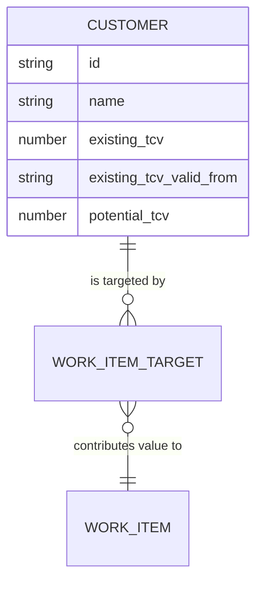

# Customers (Demand Layer)

## Overview
Customers represent the root drivers of value in the system. They are the source of Total Contract Value (TCV), which fuels the prioritization of Work Items.

## Data Model
```typescript
export interface TcvHistoryEntry {
  id: string;
  value: number;
  valid_from: string; // ISO date
}

export interface Customer {
  id: string;
  name: string;
  existing_tcv: number;  // Latest "Actual" realized value
  existing_tcv_valid_from?: string; // Date from which the current Actual value is valid
  potential_tcv: number; // Growth opportunity
  tcv_history?: TcvHistoryEntry[]; // Historical records of Existing TCV
}
```

## TCV History & Lifecycle
The system maintains a robust audit trail of **Existing TCV** evolution. 

### 1. Actual TCV
The `existing_tcv` and `existing_tcv_valid_from` fields represent the current state of the customer's contract. In the UI, these fields are protected to ensure data integrity.

### 2. The "Archive-and-Set" Update Process
To change a customer's Actual TCV, the system uses a lifecycle-aware update process:
1. **Archive:** The current "Actual" value and its "Valid From" date are moved into the `tcv_history` array as a new historical entry.
2. **Set:** The user provides a new Man-Day value and a new "Valid From" date, which become the new "Actual" state.
3. **Strategic Impact:** This allows the system to tie Work Items to specific points in time, showing how an initiative delivered value against a specific contract value rather than just the latest one.

## Visual Representation
In the ValueStream, customers are rendered as `CustomerNode` types:
- **Inner Circle:** Solid blue, representing the latest `existing_tcv`.
- **Outer Ring:** Dashed blue, representing `total_tcv` (`existing + potential`).
- **Scaling:** The diameter scales proportionally based on the maximum TCV across all customers in the dataset.

## Relationships
- **Work Items:** Customers are linked to Work Items via `customer_targets`. This relationship defines the ROI impact of a Work Item. Users can manage these targets from either the Work Item page or the Customer page. On the Customer page, the "Targeted Work Items" tab allows adding new work item targets to both new and existing customers via a searchable dropdown, and choosing whether to target the "Latest Actual" TCV or a specific entry from the history.



## Logic & Filtering
- **Min TCV Filter:** Global filter that hides customers (and their downstream trees) if their total TCV is below the threshold.
- **Standalone Visibility:** Customers with no linked Work Items are only visible if no Work Item, Team, or Issue filters are active.

## Support Issues & Jira Integration
The system allows tracking customer support health through both manual entries and Jira integration.

### 1. Manual Support Issues
Users can manually add Support Issues to a customer. Each issue includes:
- **Description:** Detailed explanation of the problem.
- **Status:** Lifecycle state (To Do, Work In Progress, Done, etc.).
- **Related Jiras:** A list of Jira keys that are associated with this manual issue.
- **Expiration Date:** Support issues are automatically removed from the system once they pass their expiration date. This cleanup is triggered whenever a user visits the Support list page or the specific Customer's support tab.

### 2. Support Overview & Jira Synchronization
When Jira integration is configured, the Customer Page displays a "Support Overview" tab that pulls live data from Jira.

- **Automatic Synchronization:** The system automatically fetches Jira issues matching the global JQL queries defined in settings. These issues are categorized as **New / Untriaged**, **Active Work**, or **Blocked / Pending**.
- **Linked Issue Persistence:** Any Jira issues explicitly mentioned in a customer's manual Support Issues (under "Related Jiras") are also automatically fetched by their specific keys. This ensures that even if a linked Jira doesn't match the current JQL filters (e.g., it was closed or moved to a different project), its latest status and summary are still tracked.
- **Database Caching:** All fetched Jira data (summaries, statuses, priorities) is persisted in the local database. This provides a consistent view for other parts of the system (like the Support Page) without requiring constant real-time Jira API calls.
- **Quick Link:** For unlinked Jira issues found via JQL, users can use a dropdown to:
    - **Link to Existing:** Add the Jira key to an existing manual Support Issue.
    - **Create New:** Automatically create a new manual Support Issue using the Jira summary and link the key.

This ensures that all relevant customer support activity is triaged and accounted for in the system's health tracking.


