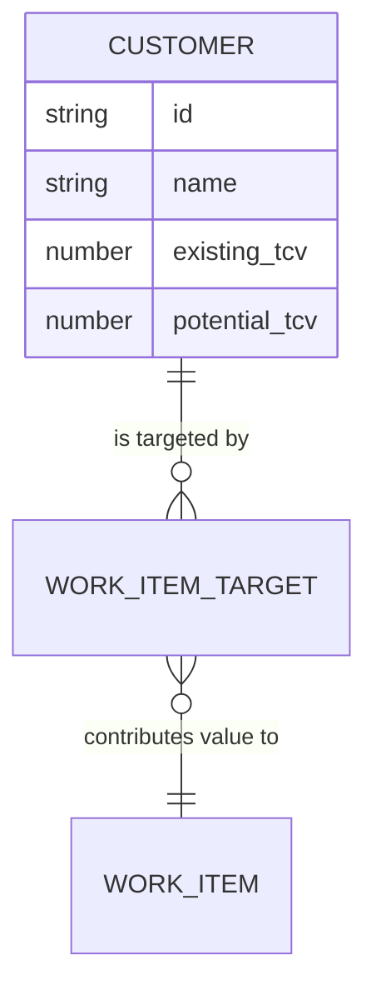

# Customers (Demand Layer)

## Overview
Customers represent the root drivers of value in the system. They are the source of Total Contract Value (TCV), which fuels the prioritization of Work Items.

## Data Model
```typescript
export interface Customer {
  id: string;
  name: string;
  existing_tcv: number;  // Realized value
  potential_tcv: number; // Growth opportunity
}
```

## Visual Representation
In the dashboard, customers are rendered as `CustomerNode` types:
- **Inner Circle:** Solid blue, representing `existing_tcv`.
- **Outer Ring:** Dashed blue, representing `total_tcv` (`existing + potential`).
- **Scaling:** The diameter scales proportionally based on the maximum TCV across all customers in the dataset.

## Relationships
- **Work Items:** Customers are linked to Work Items via `customer_targets`. This relationship defines the ROI impact of a Work Item.



## Logic & Filtering
- **Min TCV Filter:** Global filter that hides customers (and their downstream trees) if their total TCV is below the threshold.
- **Standalone Visibility:** Customers with no linked Work Items are only visible if no Work Item, Team, or Epic filters are active.
