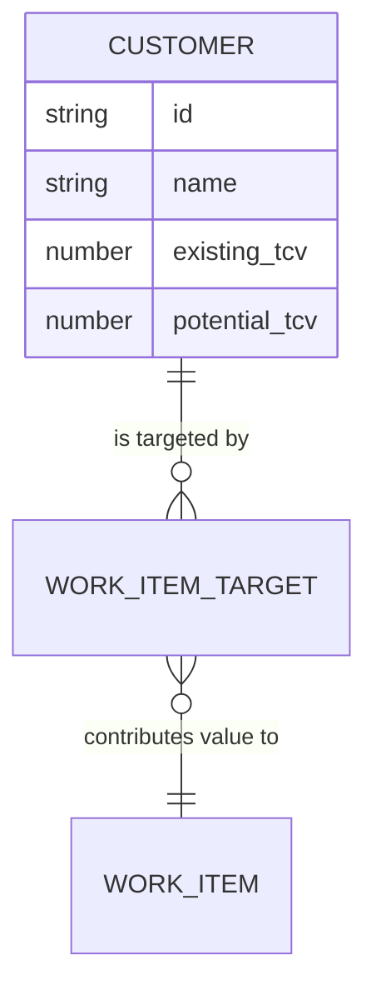

# Customers (Demand Layer)

## Overview
Customers represent the root drivers of value in the system. They are the source of Total Contract Value (TCV), which fuels the prioritization of Work Items.

## Data Model
```typescript
export interface TcvHistoryEntry {
  id: string;
  value: number;
  valid_from: string; // ISO date
}

export interface Customer {
  id: string;
  name: string;
  existing_tcv: number;  // Latest "Actual" realized value
  potential_tcv: number; // Growth opportunity
  tcv_history?: TcvHistoryEntry[]; // Historical records of Existing TCV
}
```

## TCV History
The system maintains a history of **Existing TCV** changes. 
- **Actual TCV:** The `existing_tcv` field always represents the current, latest value.
- **Historical Entries:** The `tcv_history` array stores past values and the date from which they became valid.
- **Strategic Impact:** This allows the system to tie Work Items to specific points in time, showing how an initiative delivered value against a specific contract value rather than just the latest one.

## Visual Representation
In the dashboard, customers are rendered as `CustomerNode` types:
- **Inner Circle:** Solid blue, representing the latest `existing_tcv`.
- **Outer Ring:** Dashed blue, representing `total_tcv` (`existing + potential`).
- **Scaling:** The diameter scales proportionally based on the maximum TCV across all customers in the dataset.

## Relationships
- **Work Items:** Customers are linked to Work Items via `customer_targets`. This relationship defines the ROI impact of a Work Item. Work Items can target either the "Latest Actual" TCV or a specific entry from the history.



## Logic & Filtering
- **Min TCV Filter:** Global filter that hides customers (and their downstream trees) if their total TCV is below the threshold.
- **Standalone Visibility:** Customers with no linked Work Items are only visible if no Work Item, Team, or Epic filters are active.
