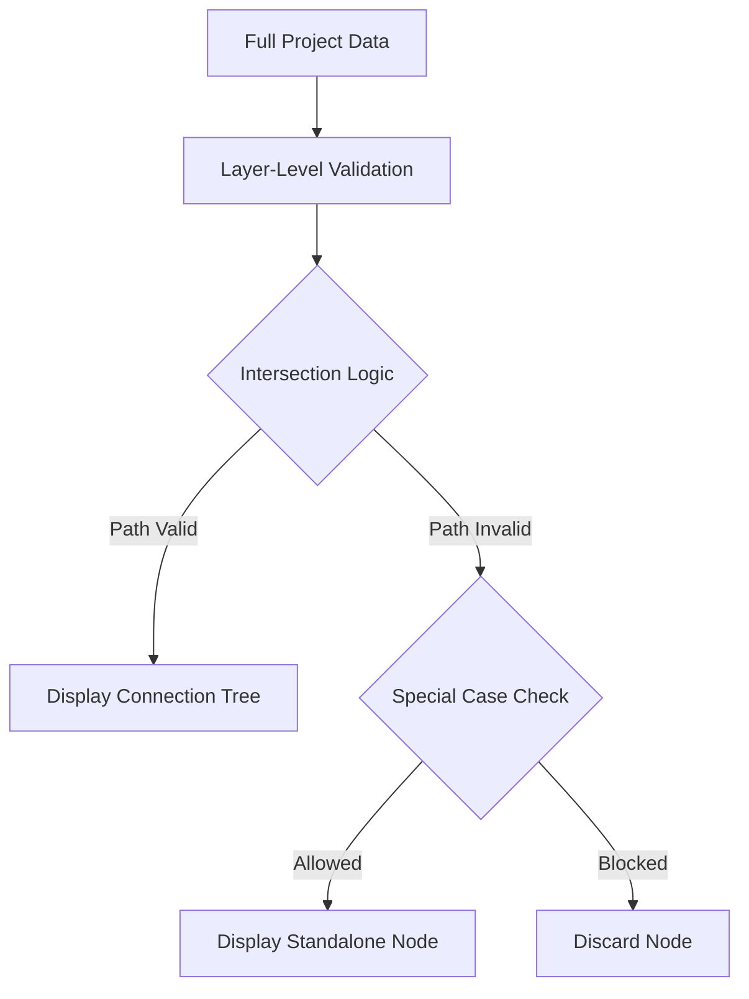

# Persistent Dashboards

## Overview
The system allows users to create multiple "views" of the project data using persistent dashboard definitions. Each dashboard stores a set of filter parameters that define the visible scope of the value stream.

## Data Model
```typescript
export interface DashboardEntity {
  id: string;
  name: string;
  description: string;
  parameters: DashboardParameters;
}

export interface DashboardParameters {
  customerFilter: string;
  workItemFilter: string;
  releasedFilter: 'all' | 'released' | 'unreleased';
  minTcvFilter: string;
  minScoreFilter: string;
  teamFilter: string;
  epicFilter: string;
  startSprintId?: string; // Persistent Time Range
  endSprintId?: string;
}
```

## Filtration Architecture

The dashboard employs a multi-layered filtering system that combines **Transient Filters** (user's current view state) and **Persistent Filters** (defined in the dashboard parameters).

### 1. Filter Combination Logic
When a dashboard is active, the engine merges the two sets of parameters as follows:

| Filter Type | Combining Logic | Resulting Behavior |
| :--- | :--- | :--- |
| **Text Filters** (Name/Jira Key) | `Transient OR Persistent` | Nodes matching *either* string are considered valid for that layer. |
| **Numeric Filters** (TCV / Score) | `Math.max(Transient, Persistent)` | The stricter (higher) threshold always takes precedence. |
| **Release Filter** | Stricter match | If either filter is set to "Released" or "Unreleased", that status is enforced. |
| **Sprint Range** | Persistent Only | This is a structural constraint defined at the dashboard level. |

### 2. The Visibility Pipeline
The `useGraphLayout` hook processes data through a specific pipeline to determine which nodes and edges appear:

#### Step A: Layer-Level Validation
Each entity type is first checked against its own specific filters:
- **Valid Customers:** Must pass combined TCV and Name filters.
- **Valid Work Items:** Must pass combined Score, Name, and Release status filters.
- **Valid Epics:** Must pass combined Team, Name, and **Sprint Range** filters. 
    - *Sprint Range Logic:* An epic is valid only if its `target_start` or `target_end` falls within the boundary dates of the selected `startSprintId` and `endSprintId`.

#### Step B: Strict Intersection (The Connection Tree)
The system iterates through all Work Items to find "Viable Paths". A Work Item and its connected nodes are only visible if they satisfy the following "Must-Have" rules:

1.  **If any Customer Filter is active:** The Work Item **must** be connected to at least one **Valid Customer**.
2.  **If any Team/Epic/Range Filter is active:** The Work Item **must** be connected to at least one **Valid Epic**.
3.  **Path Visibility:** If a path survives these checks, the Work Item, its connected Valid Customers, and its connected Valid Epics are all marked as **Visible**.

#### Step C: Special Case Logic (Standalone Items)
To prevent the dashboard from appearing empty when only partial data exists, certain nodes can appear without a full connection tree:
- **Standalone Customers:** Appear only if **NO** Work Item filters, Team filters, or Sprint Range filters are active.
- **Standalone Epics:** Appear only if **NO** Customer filters or Work Item filters are active.

### 3. Summary of Filter Combinations

| Combination | Visibility Result |
| :--- | :--- |
| **No Filters** | All nodes in the database are visible. |
| **Customer TCV Only** | Shows all customers above TCV, and ONLY the work items and epics connected to them. |
| **Sprint Range Only** | Shows only Epics in that range, and ONLY the Work Items and Customers connected to those epics. Standalone customers are hidden. |
| **TCV + Sprint Range** | Shows the intersection: Customers > TCV who have work connected to Epics in that Range. |
| **Team + Release Status** | Shows only "Released" Work Items that have child Epics assigned to that specific Team. |




## Configuration
- Dashboards are managed via the **Dashboard List** page.
- Parameters are edited via the **Edit Parameters** button located in the top-right corner of the active dashboard.
- Parameters are stored in the MongoDB `dashboards` collection.
