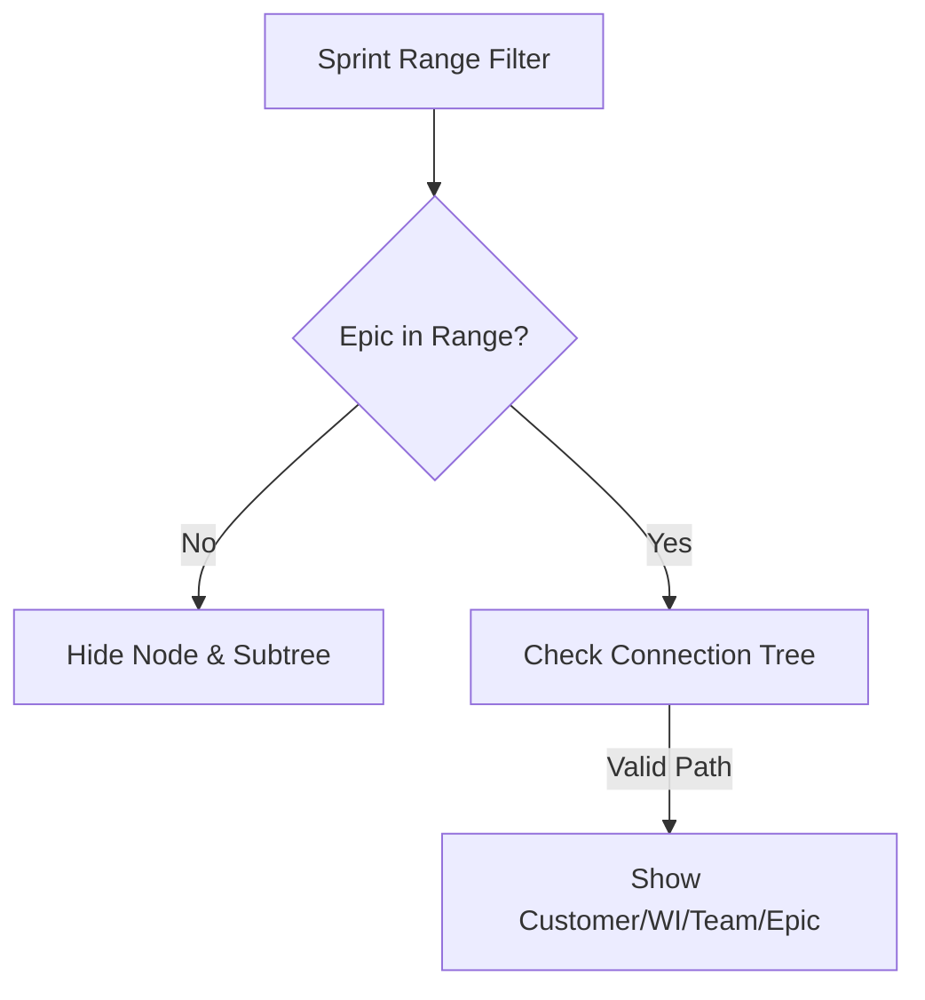

# Persistent Dashboards

## Overview
The system allows users to create multiple "views" of the project data using persistent dashboard definitions. Each dashboard stores a set of filter parameters that define the visible scope of the value stream.

## Data Model
```typescript
export interface DashboardEntity {
  id: string;
  name: string;
  description: string;
  parameters: DashboardParameters;
}

export interface DashboardParameters {
  customerFilter: string;
  workItemFilter: string;
  releasedFilter: 'all' | 'released' | 'unreleased';
  minTcvFilter: string;
  minScoreFilter: string;
  teamFilter: string;
  epicFilter: string;
  startSprintId?: string; // Persistent Time Range
  endSprintId?: string;
}
```

## Sprint Range Filtering
The persistent dashboard settings include a "Time Range (Sprint Scope)".

### Logic
- **Scope:** Defines the window of execution.
- **Criteria:** A Work Item or Customer is displayed if it is part of a connection tree containing at least one Epic that falls within the selected sprint range.
- **Epic Validity:** An epic is "in-range" if either its `target_start` or `target_end` falls between the start and end sprints of the dashboard.



## Configuration
- Dashboards are managed via the **Dashboard List** page.
- Parameters are edited via the **Edit Parameters** button located in the top-right corner of the active dashboard.
- Parameters are stored in the MongoDB `dashboards` collection.
