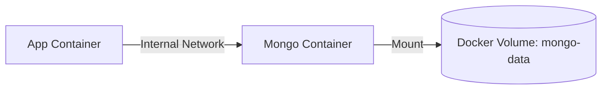

# Deployment & Networking

## 1. Standalone (Local Development)

Ideal for individual developers running everything directly on the host machine.
- Start both services concurrently using `npm run dev` from the project root.
- The Fastify backend runs on port 4000; the Vite frontend on port 5173.

## 2. Docker (Containerised Environments)

- **Development:** Uses `docker-compose.yml` with hot-reloading.
- **Production:** Uses a multi-stage build (`docker-compose.prod.yml`) to compile the React app and serve it statically via Nginx, which reverse-proxies to the Fastify container.

### Dockerised Persistence

The `docker-compose.yml` file spins up a fully connected environment.

1. **Start Services:** Run `docker-compose up --build` from the root directory.
2. **Configuration:** Inside the application's **Settings**, update the **MongoDB URI** to:
   - `mongodb://mongodb:27017`
3. **Persistence:** Data is stored in a named Docker volume (`mongo-data`), ensuring it persists even if containers are stopped or removed.

## 3. Kubernetes (Cluster Deployment)

Manifests are provided in the `k8s/` directory.
- Decoupled Pods for the Nginx Web Client, Fastify Backend, and MongoDB.
- `ADMIN_SECRET` is managed via a Kubernetes Secret object.

## Networking & SSH Tunneling

To support MongoDB clusters behind secure SSH bastions, the application employs a systematic SOCKS5 architecture.

### SOCKS5 vs. Port Forwarding

Standard SSH Port Forwarding fails with MongoDB SRV records because the driver connects to the real hostnames of the cluster members. SOCKS5 acts as a dynamic proxy that captures all traffic from the driver.

### Architecture Patterns

| Environment | Pattern | Implementation |
| :--- | :--- | :--- |
| **Local Dev** | **External Proxy** | Start a tunnel via `./scripts/start-tunnel.ps1`. Backend picks up env vars. |
| **Docker (A)** | **Direct** | Set `SOCKS_PROXY_HOST=` for local/unprotected DBs. |
| **Docker (B)** | **Service Sidecar** | The backend connects to the `ssh-proxy` container in the bridge network. |
| **Docker (C)** | **Host Workaround** | The backend connects to `host.docker.internal` (Mac/PC host tunnel). |
| **Kubernetes** | **Pod Sidecar** | An SSH container runs alongside the backend in the same Pod. |

### Systematic Discovery

The backend checks for the following environment variables:
- `SOCKS_PROXY_HOST`: The IP/Hostname of the SOCKS5 proxy.
- `SOCKS_PROXY_PORT`: The port for the external proxy.

Setting these variables does not automatically force all traffic through the proxy. Users must explicitly enable the "Use Proxy" toggle for each database connection in the UI Settings.
