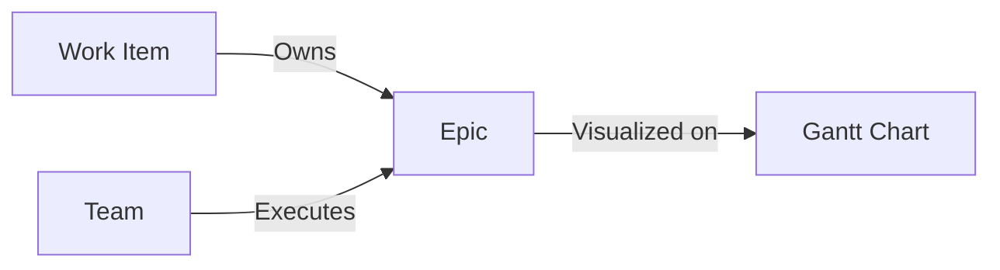

# Epics (Execution Layer)

## Overview
Epics are the primary units of execution. They physically exist on the timeline and are the final link in the chain from Customer to Delivery.

## Data Model
```typescript
export interface Epic {
  id: string;
  name?: string;
  jira_key: string;
  work_item_id: string;
  team_id: string;
  effort_md: number;
  target_start?: string; // YYYY-MM-DD
  target_end?: string;   // YYYY-MM-DD
  dependencies?: EpicDependency[];
  sprint_effort_overrides?: Record<string, number>;
}
```

## Visual Representation
- **Node Type:** `GanttBarNode`.
- **Placement:** Positioned on the X-axis based on `target_start`/`target_end` relative to the visible sprint window. Positioned on the Y-axis inside the swimlane of their assigned `team_id`.
- **Color:** Inherits the specific color assigned to its parent `WorkItem`.
- **Intensity:** The brightness of segments indicates the concentration of effort in a specific sprint.

## Relationships
- **Work Items:** Every Epic belongs to one parent Work Item.
- **Teams:** Every Epic is assigned to one Team.
- **Dependencies:** Epics can depend on other Epics (`Finish-to-Start` or `Finish-to-Finish`), rendered as animated orange arrows.



## Logic
- **Historical Actuals:** Sprints older than the active sprint are "frozen". Dates for epics with work in frozen sprints are restricted to prevent data corruption.
- **Sync:** Can be updated from Jira to pull latest dates, team, and effort.
