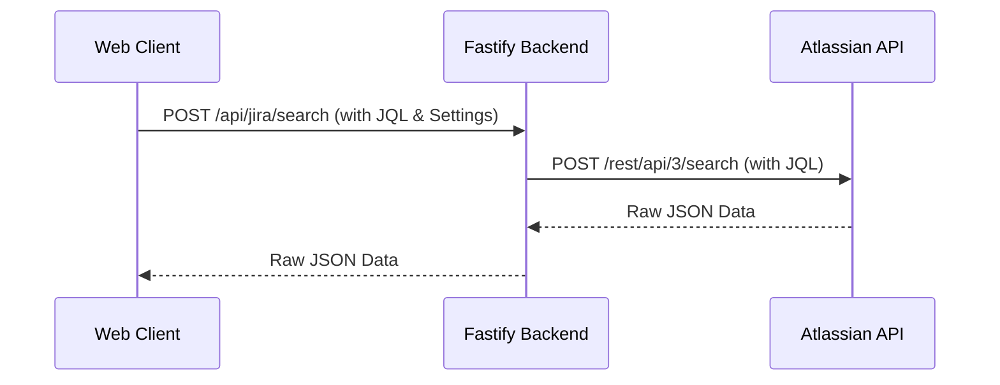

# Jira Integration

## Overview
The application integrates with Atlassian Jira to hydrate execution data (Issues) and track customer-linked issues.

## Connection Architecture
To bypass browser CORS restrictions, all Jira API requests are routed through the Fastify backend server.

All integration endpoints (`/api/jira/issue`, `/api/jira/search`) expect the necessary Jira configuration (`base_url`, `api_token`, etc.) to be passed within the `jira` section of the request body. This ensures the proxy remains stateless and can handle requests across different integration environments.

## Data Mapping
The system maps the following fields from Jira to the local model:
- **`Summary`** -> `name`
- **`Target start`** (Custom Field) -> `target_start`
- **`Target end`** (Custom Field) -> `target_end`
- **`Remaining Estimate`** -> `effort_md` (converted to man-days)
- **`Team`** (Custom Field) -> `team_id` (matched via name)

## Customer Issue Tracking
Users can define global JQL queries in the settings to categorize issues:
- **New JQL:** Criteria for unstarted issues (Untriaged).
- **In-Progress JQL:** Criteria for active issues.
- **Noop JQL:** Criteria for blocked or pending issues.

### Automated Sync & Persistence
The system maintains customer support health using a hybrid synchronization model:
1. **JQL Fetch:** Periodic fetches based on global JQL settings to identify trending issues.
2. **Key-based Fetch:** Automatic fetch of all Jira keys explicitly linked to manual **Support Issues**, even if they no longer match the global JQL filters. This ensures status-aware tracking of specifically prioritized issues.
3. **Database Caching:** All fetched Jira metadata (summary, status, priority, url) is merged into the customer document's `jira_support_issues` field. This allows for:
   - Consistent data availability even when offline or Jira is unreachable.
   - High-performance analysis by the AI Support Assistant.
   - Simplified reporting in the Support Dashboard.

## Bulk Sync & Import
The Jira settings are organized into three sub-tabs for better management:
- **Common:** Configure the Jira Base URL, API Version, and Personal Access Token (PAT). Includes a **Test Connection** tool.
- **Issues:** Tools for bulk operations:
    - **Import from Jira:** Executes the user's JQL **verbatim** and creates new Issues (and potentially Work Items) in the local database. The query is not modified — narrow the result set yourself with clauses like `issuetype != Sub-task` or `status != Done` if needed. Results are fully paginated (no 100-issue cap).
    - **Also import children (follow Parent Link):** Optional checkbox next to the import JQL. When enabled (`include_children: true`), after the base JQL runs the backend fetches **one level** of children — issues whose **`"Parent Link"`** field points at any base-result key. Parent keys are batched (≤50 per query, via `"Parent Link" in (...)`) and each batch is paginated. Results are deduped by issue key, so a child already in the base set (or already present locally) is never imported twice. Note: this follows the Advanced-Roadmaps **Parent Link** field only — not the `parent` field or **Epic Link**. A failed child batch is fail-soft: the import completes and the result message notes the incomplete batches.
    - **Sync Issues from Jira:** Iterates through all local issues with a `jira_key` and refreshes their metadata.
    - **Align work-item hierarchy to Jira (Parent Link):** Optional checkbox next to Sync Issues (default off). When enabled, after the metadata refresh the sync reconciles `WorkItem.parent_id` to the Jira **Parent Link** hierarchy — Jira is the source of truth, but only for issues/work items **already present** in the system. For each synced jira whose Parent Link points at an in-system parent jira, the child jira's work item is made a child of the parent jira's work item. Rules: skips when either jira is **Unassigned** (no `work_item_id`) or its work item was deleted; skips when both jiras share one work item; **never clears** an existing `parent_id` (a jira with no Parent Link leaves the hierarchy untouched, preserving manual/Aha! links); when several jiras in the same work item disagree on the parent it is reported as a **conflict** and left untouched; edges that would form a **cycle** are skipped. The result message reports `aligned / conflicts skipped / cycles skipped`. Pure planning lives in `web-client/src/utils/businessLogic.ts` (`planHierarchyAlignment`).
- **Customer:** Define JQL queries to automatically identify and track specific issue types linked to customers using the `{{CUSTOMER_ID}}` placeholder.

## Error Handling
`/api/jira/search` propagates Jira's HTTP status and `errorMessages` back to the caller — a JQL syntax error or a 401 surfaces as `{ success: false, error: "<jira message>" }` with the original status code, rather than being swallowed as an empty result.
