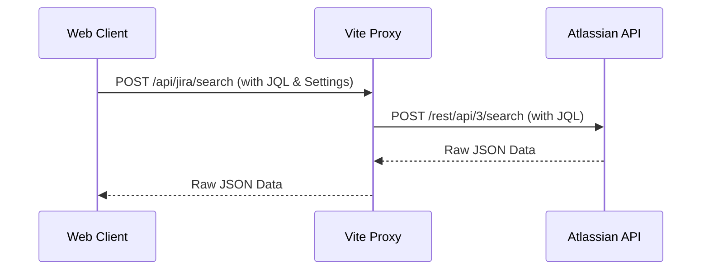

# Jira Integration

## Overview
The application integrates with Atlassian Jira to hydrate execution data (Epics) and track customer-linked issues.

## Connection Architecture
To bypass browser CORS restrictions, all Jira API requests are routed through a server-side proxy managed by the Vite development server.

All integration endpoints (`/api/jira/issue`, `/api/jira/search`) expect the necessary Jira configuration (`jira_base_url`, `jira_api_token`, etc.) to be passed within the JSON request body. This ensures the proxy remains stateless and can handle requests across different integration environments.

## Data Mapping
The system maps the following fields from Jira to the local model:
- **`Summary`** -> `name`
- **`Target start`** (Custom Field) -> `target_start`
- **`Target end`** (Custom Field) -> `target_end`
- **`Remaining Estimate`** -> `effort_md` (converted to man-days)
- **`Team`** (Custom Field) -> `team_id` (matched via name)

## Customer Issue Tracking
Users can define global JQL queries in the settings to categorize issues:
- **New JQL:** Criteria for unstarted issues.
- **In-Progress JQL:** Criteria for active issues.
- **Noop JQL:** Criteria for closed or irrelevant issues.

## Bulk Sync & Import
- **Sync All Epics:** Iterates through all local epics with a `jira_key` and refreshes their metadata.
- **Import via JQL:** Executes a custom JQL query and creates new Epics (and potentially Work Items) in the local database based on the results.
