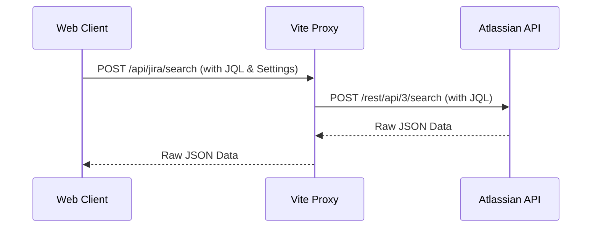

# Jira Integration

## Overview
The application integrates with Atlassian Jira to hydrate execution data (Epics) and track customer-linked issues.

## Connection Architecture
To bypass browser CORS restrictions, all Jira API requests are routed through a server-side proxy managed by the Vite development server.

All integration endpoints (`/api/jira/issue`, `/api/jira/search`) expect the necessary Jira configuration (`jira_base_url`, `jira_api_token`, etc.) to be passed within the JSON request body. This ensures the proxy remains stateless and can handle requests across different integration environments.

## Data Mapping
The system maps the following fields from Jira to the local model:
- **`Summary`** -> `name`
- **`Target start`** (Custom Field) -> `target_start`
- **`Target end`** (Custom Field) -> `target_end`
- **`Remaining Estimate`** -> `effort_md` (converted to man-days)
- **`Team`** (Custom Field) -> `team_id` (matched via name)

## Customer Issue Tracking
Users can define global JQL queries in the settings to categorize issues:
- **New JQL:** Criteria for unstarted issues (Untriaged).
- **In-Progress JQL:** Criteria for active issues.
- **Noop JQL:** Criteria for blocked or pending issues.

### Automated Sync & Persistence
The system maintains customer support health using a hybrid synchronization model:
1. **JQL Fetch:** Periodic fetches based on global JQL settings to identify trending issues.
2. **Key-based Fetch:** Automatic fetch of all Jira keys explicitly linked to manual **Support Issues**, even if they no longer match the global JQL filters. This ensures status-aware tracking of specifically prioritized issues.
3. **Database Caching:** All fetched Jira metadata (summary, status, priority, url) is merged into the customer document's `jira_support_issues` field. This allows for:
   - Consistent data availability even when offline or Jira is unreachable.
   - High-performance analysis by the AI Support Assistant.
   - Simplified reporting in the Support Dashboard.

## Bulk Sync & Import
The Jira settings are organized into three sub-tabs for better management:
- **Common:** Configure the Jira Base URL, API Version, and Personal Access Token (PAT). Includes a **Test Connection** tool.
- **Epics:** Tools for bulk operations:
    - **Import from Jira:** Executes a custom JQL query and creates new Epics (and potentially Work Items) in the local database.
    - **Sync Epics from Jira:** Iterates through all local epics with a `jira_key` and refreshes their metadata.
- **Customer:** Define JQL queries to automatically identify and track specific issue types linked to customers using the `{{CUSTOMER_ID}}` placeholder.
