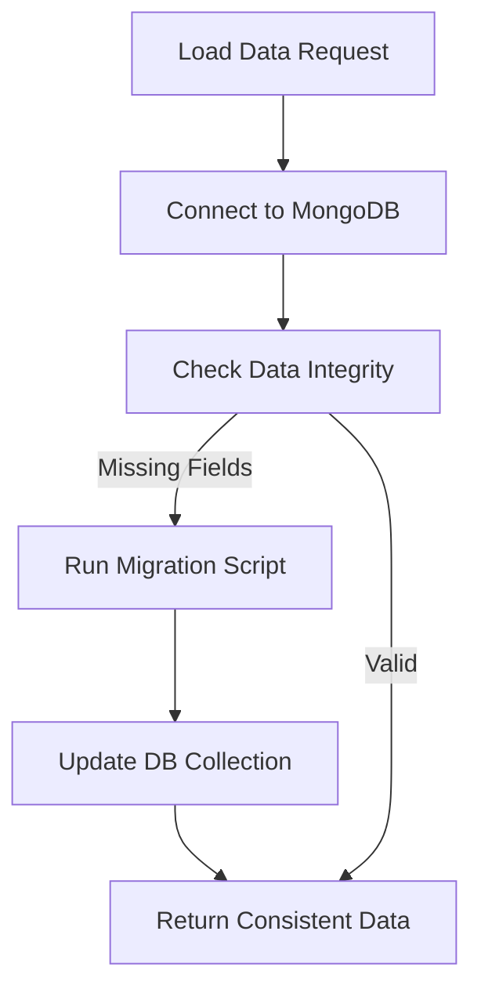
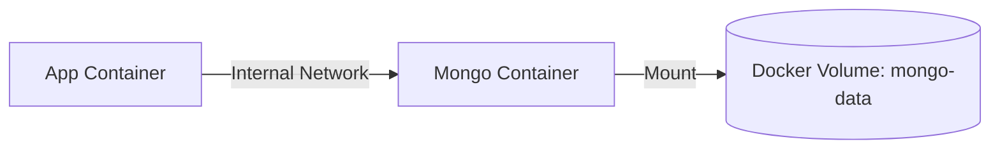

# Persistence & Migrations

## Overview
The application uses a dual-mode persistence strategy to balance ease of local development with robust multi-user storage.

## Data Storage
- **MongoDB:** Primary storage for production-like environments. Entities are stored in collections named after their logical types: `customers`, `workItems`, `teams`, `epics`, `sprints`, and `dashboards`.
- **`staticImport.json`:** A fallback file-based storage used for seeding the database or sharing project state.

## The Vite Persistence Plugin
The "backend" logic resides in `web-client/vite.config.ts`. It utilizes `server.middlewares` to provide API endpoints:
- **`GET /api/loadData`:** Fetches the entire project state and executes migrations.
- **`POST /api/entity/{collection}`:** Handles Upsert operations.
- **`DELETE /api/entity/{collection}`:** Handles record removal.

## Migration System
The system includes an automatic migration handler inside the `/api/loadData` endpoint to ensure data consistency across versions.

### Example: Sprint Quarter Migration
When the data model was extended to include persisted `quarter` attributes on sprints, a migration was added to:
1. Identify sprints missing the `quarter` field.
2. Recompute the quarter using the `fiscal_year_start_month` setting.
3. Update the MongoDB collection retroactively.

## Dockerized Persistence

The application includes a `docker-compose.yml` file to quickly spin up a fully connected environment.

### Deployment
1.  **Start Services:** Run `docker-compose up --build` from the root directory.
2.  **Configuration:** Inside the application's **Settings** (⚙️), update the **MongoDB URI** to:
    - `mongodb://mongodb:27017`
3.  **Persistence:** Data is stored in a named Docker volume (`mongo-data`), ensuring it persists even if containers are stopped or removed.

## Seeding
If the MongoDB database is empty on load, the plugin automatically reads `web-client/public/staticImport.json` and inserts the data into the corresponding collections.
