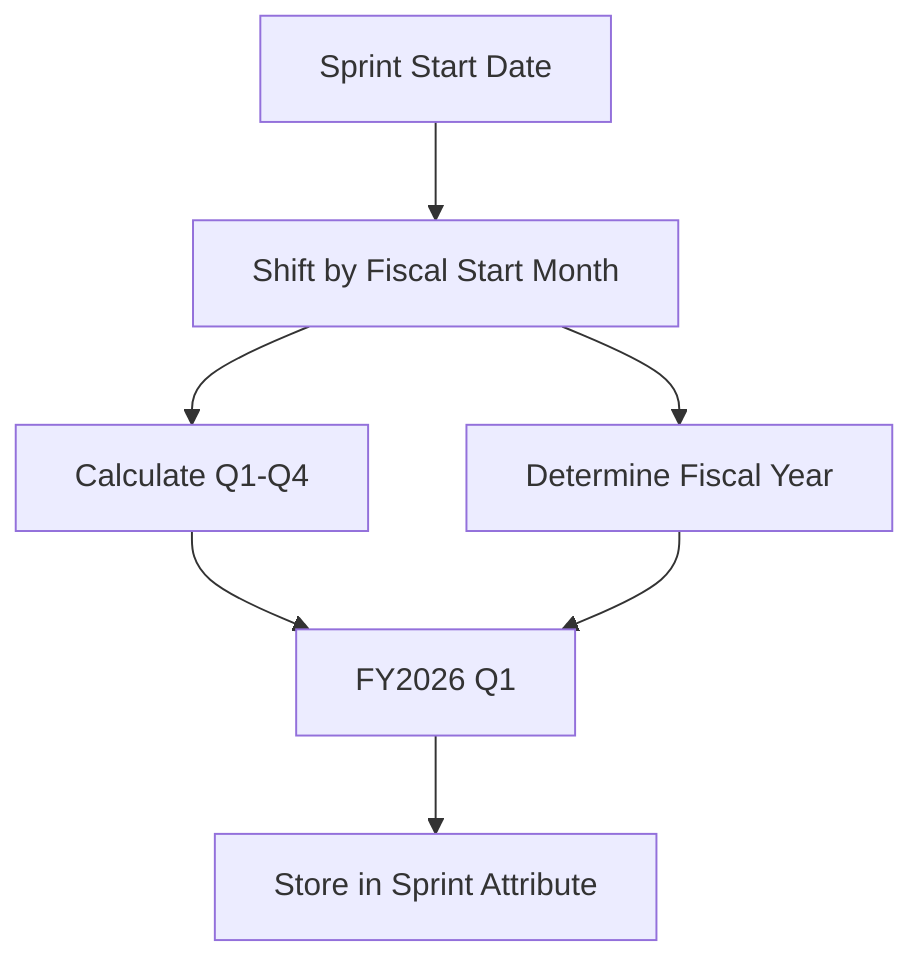

# Sprints & Time Hierarchy

## Overview
Sprints define the calendar grid for the execution timeline. They provide the necessary time-fencing for planning and tracking historical progress.

## Data Model
```typescript
export interface Sprint {
  id: string;
  name: string;
  start_date: string; // YYYY-MM-DD
  end_date: string;   // YYYY-MM-DD
  quarter?: string;   // FYXXXX QX (Computed and persisted)
}
```

## Time Hierarchy
Sprints are grouped into **Fiscal Quarters** based on the project's `fiscal_year_start_month` setting.

### Calculation Logic


## Planning Configuration
Users can define:
- **Fiscal Year Start Month:** (1-12) to align with company financial calendars.
- **Default Sprint Duration:** The number of days (typically 14) for automatically calculating the end date of newly created sprints.

## Rules & Constraints
- **Unbroken Sequence:** The system enforces a gap-free timeline. New sprints automatically start the day after the current last sprint.
- **Locking:** Sprints are locked for deletion unless they are the final sprint in the schedule, preserving historical continuity.
- **Historical Freeze:** The "Active Sprint" is determined by current system date. All sprints ending before the active sprint's start date are considered "frozen".
