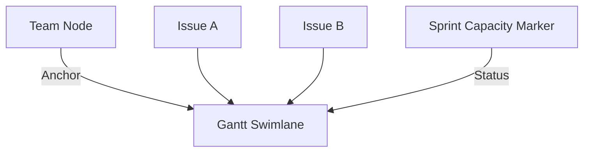

# Teams (Supply Layer)

## Overview
Teams represent the engineering resources available to execute on strategic initiatives. They act as the "Who" and the primary constraint in the value stream.

## Data Model
```typescript
export interface TeamMember {
  name: string;
  username: string;
  capacity_percentage: number;
}

export interface Team {
  id: string;
  name: string;
  total_capacity_mds: number; // Base man-days per sprint
  country?: string;           // For holiday calculation (ISO code)
  sprint_capacity_overrides?: Record<string, number>;
  ldap_team_name?: string;    // LDAP group name for member sync
  members?: TeamMember[];     // Team members with capacity allocation
}
```

## Capacity Logic
The system calculates available capacity for each team per sprint:
1. **Base Capacity:** `total_capacity_mds`.
2. **Refined Holiday Impact:** Automatic reduction of capacity (10% per **public holiday** that falls on a weekday) using the `date-holidays` library based on the team's `country`. Observances or religious holidays that are not public days off are excluded.
3. **Overrides:** Sprint-specific capacity adjustments manually set by users.
   - **Visual Feedback:** Active overrides are highlighted in blue in the Team Detail page.
   - **Quick Clear:** Users can click the "×" button to revert to the calculated capacity.

## Team Management
- **Add Team:** New teams can be created from the Team List page.
- **Delete Team:** Teams can be deleted from their detail page (includes a confirmation dialog and automatic clearing of team assignments for affected issues).

## Visual Representation
- **Node Type:** `TeamNode`.
- **Scaling:** Size scales based on `total_capacity_mds`.
- **Pivot Point:** In the layout, Team nodes serve as the vertical anchors for their respective Gantt swimlanes.

## Relationships
- **Issues:** Teams are assigned to Issues. Multiple Issues for the same team in the same sprint will vertically stack within the team's swimlane.



## Member Management
The **Members** tab on the Team Detail page provides inline CRUD for team members.

### Fields
| Field | Description |
|-------|-------------|
| Name | Display name of the team member |
| Username | Unique identifier (used as merge key for LDAP sync) |
| Capacity % | Percentage of capacity this member contributes (default: 100) |

### Estimate Capacity from Members
A header action on the Members tab seeds `Team.total_capacity_mds` from the current member roster instead of having you maintain the number by hand. The button is disabled until the team has at least one member; clicking it asks for confirmation before overwriting the existing value.

**Formula** (lives in `web-client/src/utils/businessLogic.ts` as `estimateTeamCapacityMds`):

```
workingDays = sprint_duration_days × 5/7              // settings → general.sprint_duration_days; 14 → 10
gross       = Σ workingDays × (member.capacity_percentage / 100)
net         = gross × TEAM_CAPACITY_PTO_FACTOR        // 0.8 — leaves 20% for PTO/sickness
total_capacity_mds = round(net, 1 decimal)
```

Country-specific holiday reductions are intentionally NOT applied here — those live in the **Capacity Overrides** tab, which knows the actual per-sprint dates. This action only seeds the *baseline* `total_capacity_mds`; per-sprint overrides on top of it (whether manual or holiday-driven) keep working as before.

**Examples:**
| Members | Sprint length | total_capacity_mds |
|---|---|---|
| 1 × 100 % | 14 days | 8.0 |
| 1 × 100 % + 1 × 50 % | 14 days | 12.0 |
| 1 × 33 % | 14 days | 2.6 |
| 1 × 100 % | 7 days | 4.0 |

### LDAP Sync
When LDAP is configured in Settings (LDAP tab → General & Team subtabs), an additional **LDAP Team Name** field appears at the top of the Members tab.

**Workflow:**
1. Enter the LDAP group name (e.g., `engineering`).
2. Click **Sync from LDAP** to query the configured LDAP server.
3. The system resolves group members by reading the `member` attribute DNs and looking up `displayName`/`cn` and `sAMAccountName`/`uid` for each.
4. Returned members are **merged** with existing members using `username` as the key:
   - Existing members retain their `capacity_percentage`.
   - New members are added with `capacity_percentage: 100`.
   - Members no longer in the LDAP group are removed.

**Backend endpoint:** `POST /api/ldap/sync-members` (see `backend/src/routes/ldap.ts`).

## Logic
- **Utilization:** The capacity marker (above the Gantt lane) turns red if the sum of effort from all Issues assigned to that team in a given sprint exceeds the calculated available capacity.
