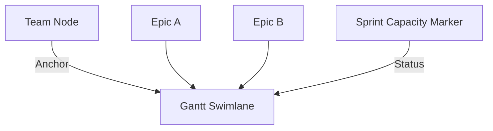

# Teams (Supply Layer)

## Overview
Teams represent the engineering resources available to execute on strategic initiatives. They act as the "Who" and the primary constraint in the value stream.

## Data Model
```typescript
export interface Team {
  id: string;
  name: string;
  total_capacity_mds: number; // Base man-days per sprint
  country?: string;           // For holiday calculation (ISO code)
  sprint_capacity_overrides?: Record<string, number>;
}
```

## Capacity Logic
The system calculates available capacity for each team per sprint:
1. **Base Capacity:** `total_capacity_mds`.
2. **Holiday Impact:** Automatic reduction of capacity (10% per public holiday) using the `date-holidays` library based on the team's `country`.
3. **Overrides:** Sprint-specific capacity adjustments manually set by users.

## Visual Representation
- **Node Type:** `TeamNode`.
- **Scaling:** Size scales based on `total_capacity_mds`.
- **Pivot Point:** In the layout, Team nodes serve as the vertical anchors for their respective Gantt swimlanes.

## Relationships
- **Epics:** Teams are assigned to Epics. Multiple Epics for the same team in the same sprint will vertically stack within the team's swimlane.



## Logic
- **Utilization:** The capacity marker (above the Gantt lane) turns red if the sum of effort from all Epics assigned to that team in a given sprint exceeds the calculated available capacity.
