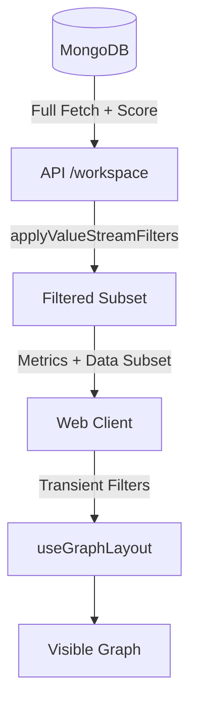

# Persistent valueStreams

## Overview
The system allows users to create multiple "views" of the project data using persistent ValueStream definitions. Each ValueStream stores a set of filter parameters that define the visible scope of the ValueStream.

## Data Model
```typescript
export interface ValueStreamEntity {
  id: string;
  name: string;
  description: string;
  parameters: ValueStreamParameters;
}

export interface ValueStreamParameters {
  customerFilter: string;
  workItemFilter: string;
  releasedFilter: 'all' | 'released' | 'unreleased';
  minTcvFilter: string;
  minScoreFilter: string;
  teamFilter: string;
  issueFilter: string;
  startSprintId?: string; // Persistent Time Range
  endSprintId?: string;
}
```

## Filtration Architecture

The ValueStream employs a multi-layered filtering system that combines **Server-Side Enforcement** (for persistent and heavy filters) and **Client-Side Transient Filters** (for live feedback).

### 1. The Hydration Phase (Server-Side)
When a ValueStream is loaded, the client requests data using `GET /api/workspace?valueStreamId=X`. The Fastify backend:
1. **Fetches all data** from MongoDB (unthrottled — scoring requires the complete dataset).
2. **Scores Work Items** on the full dataset via `enrichWorkItemsWithMetrics()` to ensure correct Should-have TCV counts and RICE scores.
3. **Applies Persistent Filters** via `applyValueStreamFilters()` using the ValueStream entity's saved `parameters` — text matches, released status, minTcv, minScore, team membership, sprint range.
4. **Checks post-filter threshold** — returns `413` if the filtered total still exceeds the limit (default: 500 items), asking the user to tighten their ValueStream parameters.
- **User control:** The threshold is enforced *after* filtering, so the user can always resolve a 413 by making their ValueStream parameters more restrictive.
- **Optimization:** Only the filtered subset is transmitted over the network.
- **Global Metrics:** The server returns global max values (e.g., `maxScore`) so the UI remains consistently scaled.

### 2. The Interaction Phase (Client-Side)
As users type in the filter bar, the `useGraphLayout` hook applies **Transient Filters** to the already-filtered dataset provided by the server:
- **Responsiveness:** Instant updates without additional network calls.
- **Combining Logic:** Transient filters are combined with server-side base parameters using Logical AND (strictest threshold wins).

### 3. Visibility Pipeline Summary

| Step | Enforcement | Logic |
| :--- | :--- | :--- |
| **Initial Load** | Backend (`/api/workspace`) | Scores on full data, then applies ValueStream Parameters via `applyValueStreamFilters()`. |
| **Numeric Thresholds** | Server & Client | `Math.max(Transient, Persistent)` - stricter wins. |
| **Text Searches** | Server & Client | Logical AND - must match persistent criteria AND transient search string. |
| **Intersection** | Client | Hides items that don't form a complete path (Customer -> WorkItem -> Issue). |



## Configuration
- Value Streams are managed via the **ValueStream List** page.
- Parameters are edited via the **Edit Parameters** button located in the top-right corner of the active ValueStream.
- Parameters are stored in the MongoDB `valueStreams` collection.


