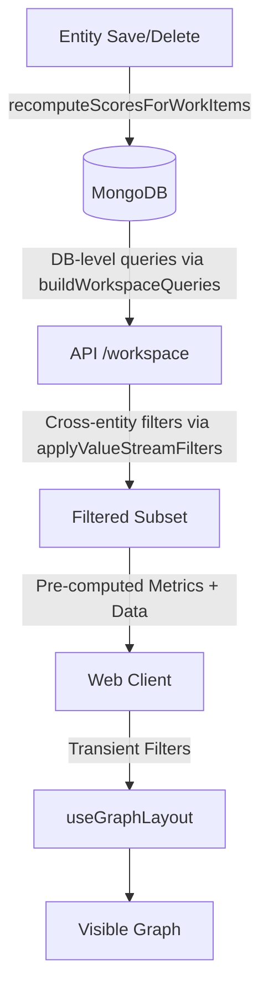

# Persistent valueStreams

## Overview
The system allows users to create multiple "views" of the project data using persistent ValueStream definitions. Each ValueStream stores a set of filter parameters that define the visible scope of the ValueStream.

## Data Model
```typescript
export interface ValueStreamEntity {
  id: string;
  name: string;
  description: string;
  parameters: ValueStreamParameters;
}

export interface ValueStreamParameters {
  customerFilter: string;
  workItemFilter: string;
  releasedFilter: 'all' | 'released' | 'unreleased';
  minTcvFilter: string;
  minScoreFilter: string;
  teamFilter: string;
  issueFilter: string;
  startSprintId?: string; // Persistent Time Range
  endSprintId?: string;
}
```

## Filtration Architecture

The ValueStream employs a multi-layered filtering system that combines **Server-Side Enforcement** (for persistent and heavy filters) and **Client-Side Transient Filters** (for live feedback).

### 1. The Hydration Phase (Server-Side)
When a ValueStream is loaded, the client requests data using `GET /api/workspace?valueStreamId=X`. The Fastify backend:
1. **Builds DB-level queries** from the ValueStream's saved parameters via `buildWorkspaceQueries()` — name text, released status, minScore (`calculated_score`), and minTcv (`$expr`) are pushed to MongoDB queries. RICE scores are pre-computed on WorkItem documents (via `recomputeScoresForWorkItems()` on every entity mutation), so score filtering happens at the DB level.
2. **Fetches filtered data** from MongoDB using the per-collection queries — only matching entities are returned from the DB.
3. **Applies cross-entity in-memory filters** via `applyValueStreamFilters()` — issue team membership and sprint range (which depend on multiple collections).
4. **Checks post-filter threshold** — returns `413` if the total still exceeds the limit (default: 500 items).
5. **Computes metrics** (`maxScore`, `maxRoi`) from the pre-computed score fields on the filtered set via `computeMetricsFromPrecomputed()`.
- **User control:** The threshold is enforced *after* filtering, so the user can always resolve a 413 by making their ValueStream parameters more restrictive.
- **Optimization:** DB-level filtering means only matching entities are fetched and transmitted.
- **Score pre-computation:** Scores are recomputed on every save/delete of workItems, customers, or issues. Run `POST /api/data/recomputeScores` once after deployment to backfill existing data.

### 2. The Interaction Phase (Client-Side)
As users type in the filter bar, the `useGraphLayout` hook applies **Transient Filters** to the already-filtered dataset provided by the server:
- **Responsiveness:** Instant updates without additional network calls.
- **Combining Logic:** Transient filters are combined with server-side base parameters using Logical AND (strictest threshold wins).

### 3. Visibility Pipeline Summary

| Step | Enforcement | Logic |
| :--- | :--- | :--- |
| **Initial Load** | Backend (`/api/workspace`) | Builds DB queries from VS params via `buildWorkspaceQueries()` (name, score, released, minTcv). Cross-entity filters (team membership, sprint range) applied in-memory by `applyValueStreamFilters()`. |
| **Numeric Thresholds** | Server & Client | `Math.max(Transient, Persistent)` - stricter wins. Score filtered at DB level using pre-computed `calculated_score`. |
| **Text Searches** | Server & Client | Logical AND - must match persistent criteria (DB-level) AND transient search string (client-side). |
| **Intersection** | Client | Hides items that don't form a complete path (Customer -> WorkItem -> Issue). |



## Configuration
- Value Streams are managed via the **ValueStream List** page.
- Parameters are edited via the **Edit Parameters** button located in the top-right corner of the active ValueStream.
- Parameters are stored in the MongoDB `valueStreams` collection.


