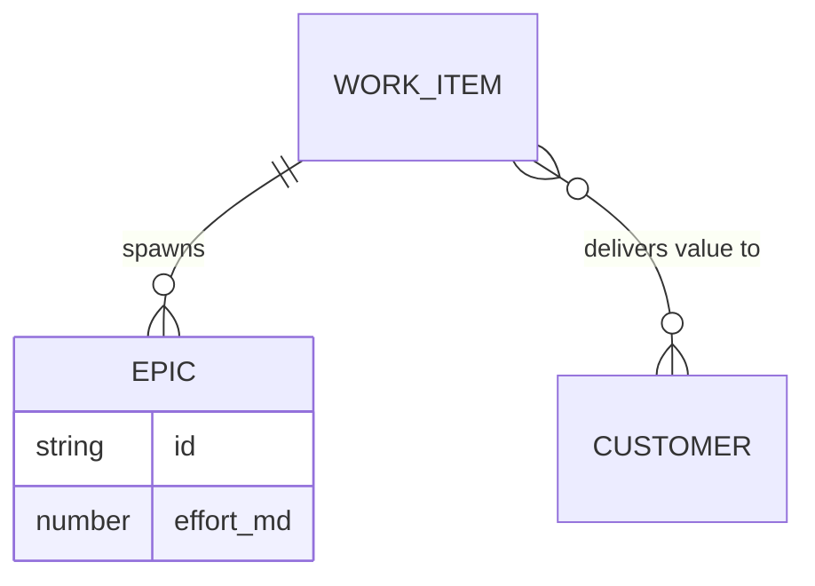

# Work Items (Scope Layer)

## Overview
Work Items (also referred to as Features) are strategic initiatives that connect customer demand to engineering execution. They represent the "What" of the product strategy.

## Data Model
```typescript
export interface WorkItem {
  id: string;
  name: string;
  total_effort_mds: number; // Estimated man-days
  score: number;            // Calculated RICE score
  customer_targets: {
    customer_id: string;
    tcv_type: 'existing' | 'potential';
    priority?: 'Must-have' | 'Should-have' | 'Nice-to-have';
    tcv_history_id?: string; // Reference to a specific historical TCV value
  }[];
  all_customers_target?: {
    tcv_type: 'existing' | 'potential';
    priority: 'Must-have' | 'Should-have' | 'Nice-to-have';
  };
  released_in_sprint_id?: string;
}
```

## Prioritization Logic (RICE Score)
The score is calculated server-side in the Vite backend plugin (`vite.config.ts`):
- **Impact:** Sum of TCV from all targeted customers, weighted by priority.
- **Effort:** The maximum of `total_effort_mds` or the sum of effort from connected Epics.
- **Formula:** `Score = Total Impact / Effort`.

### Historical Targeting
When targeting **Existing TCV**, a Work Item can be tied to a specific historical value using `tcv_history_id`. 
- If linked to history, the calculation uses that specific historical dollar value.
- If not linked (or linked to "Latest Actual"), it uses the customer's current `existing_tcv`.
- **Global Work Items:** Initiatives that target all customers (e.g., core maintenance) **always** use the latest actual TCV for their impact calculation.

```mermaid
graph LR
    TCV[Customer TCV (Actual or History)] --> Impact
    Priority[Target Priority] --> Impact
    Impact --> Score
    Effort[Man-Days] --> Score
    Score --> Scaling[Visual Node Size]
```

## Visual Representation
- **Node Type:** `WorkItemNode`.
- **Scaling:** Size scales based on the RICE score relative to the global maximum score.
- **Status Icons:**
    - `📦`: Released (linked to a sprint).
    - `⚠️`: Missing dates in connected Epics.
    - `🌐`: Global (targets all customers).

## Relationships
- **Customers:** Linked via `customer_targets`.
- **Epics:** One Work Item can spawn multiple Epics (execution units) across different Teams.



