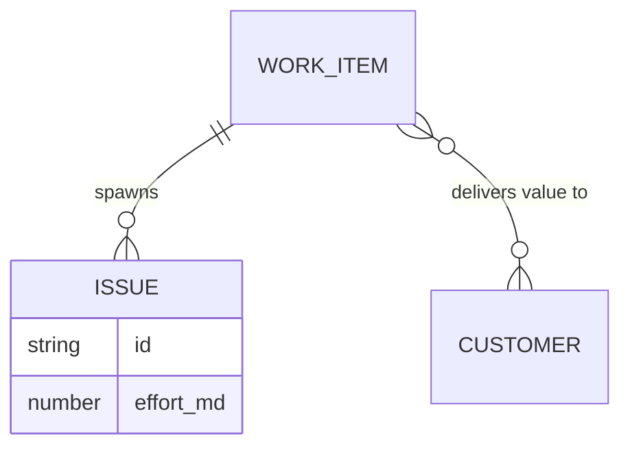

# Work Items (Scope Layer)

## Overview
Work Items (also referred to as Features) are strategic initiatives that connect customer demand to engineering execution. They represent the "What" of the product strategy.

## Data Model
```typescript
export interface WorkItem {
  id: string;
  name: string;
  description?: string; // Detailed context/requirements
  status: 'Backlog' | 'Planning' | 'Development' | 'Done';
  total_effort_mds: number; // Estimated man-days
  score: number;            // Calculated RICE score
  stackrank?: number;       // Manual priority order (higher = higher priority); undefined = unranked
  customer_targets: {
    customer_id: string;
    tcv_type: 'existing' | 'potential';
    priority?: 'Must-have' | 'Should-have' | 'Nice-to-have';
    tcv_history_id?: string; // Reference to a specific historical TCV value
  }[];
  all_customers_target?: {
    tcv_type: 'existing' | 'potential';
    priority: 'Must-have' | 'Should-have' | 'Nice-to-have';
  };
  released_in_sprint_id?: string;
}
```

## Prioritization Logic (RICE Score / ROI)
The score is calculated server-side in `backend/src/services/metricsService.ts`:
- **Formula:** `Score = Total Impact / Effort`.
- **Impact (Total TCV):** The contribution of a customer's TCV to a Work Item's Impact depends on the target priority:
    - **Must-have**: Contributes **100%** of the associated Customer TCV.
    - **Should-have**: Contributes a **shared portion** of the Customer TCV. Calculated as: `(Customer TCV) / (Total number of 'Should-have' Work Items for that particular Customer)`.
    - **Nice-to-have**: Contributes **0%** (does not add to the TCV/Impact).
- **Effort:** The `total_effort_mds` defined on the Work Item.
- **Safety:** To avoid division by zero, the effective effort used in the calculation has a floor of 1 Man-Day. Reach and Confidence are currently implicitly 1.0.

### Historical Targeting
When targeting **Existing TCV**, a Work Item can be tied to a specific historical value using `tcv_history_id`. 
- If linked to history, the calculation uses that specific historical dollar value.
- If not linked (or linked to "Latest Actual"), it uses the customer's current `existing_tcv`.
- **Global Work Items:** Initiatives that target all customers (e.g., core maintenance) **always** use the latest actual TCV for their impact calculation.

```mermaid
graph LR
    TCV[Customer TCV (Actual or History)] --> Impact
    Impact --> Score
    Effort[Man-Days] --> Score
    Score --> Scaling[Visual Node Size]
```

## Manual Priority (Stack Rank)
The `stackrank` field is a manual integer ordering used alongside the calculated RICE score. **Higher numbers indicate higher priority** so a brand-new top-priority work item can simply take `max(stackrank) + 1` without ever needing negative values. The Work Items list view supports sorting by Stack Rank — unranked items always sort to the least-prioritized end (bottom on descending, top on ascending). The field is purely informational; it does not feed into the RICE calculation.

### Sparse spacing & inserting between items
New work items default to `max(stackrank) + 1000`, giving 1000-unit gaps between consecutive ranks. To insert an item between two neighbors, just type any integer in the gap (e.g. between 2000 and 3000, use 2500). Over time the gaps shrink. When that happens, the **Compact Ranks** button on the Work Items list page renumbers all currently-ranked items to clean multiples of 1000 (1000, 2000, 3000, …) preserving their existing order. Unranked items are left untouched.

## Visual Representation
- **Node Type:** `WorkItemNode`.
- **Scaling:** Size scales based on the RICE score relative to the global maximum score.
- **Tooltip:** Hovering over the node displays the `description`.
- **Status Icons:**
    - `📦`: Released (linked to a sprint).
    - `🕒`: Missing dates in connected Issues.
    - `📏`: Effort Not Estimated (0 MDs on item or any connected issue).
    - `🌐`: Global (targets all customers).

## Relationships
- **Customers:** Linked via `customer_targets`.
- **Issues:** One Work Item can spawn multiple Issues (execution units) across different Teams.



