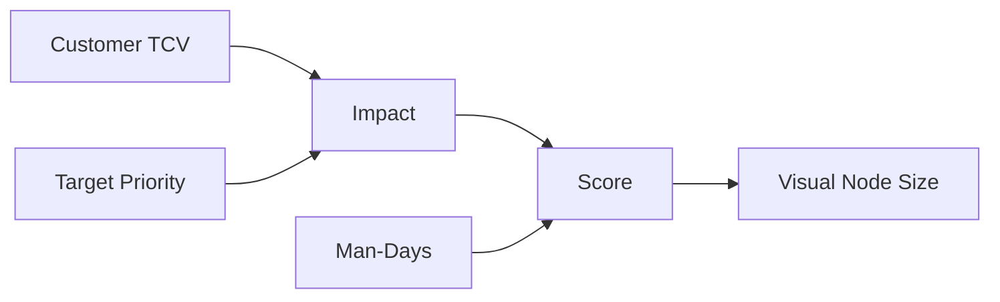
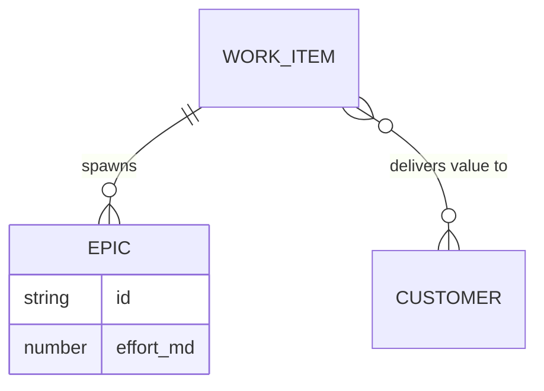

# Work Items (Scope Layer)

## Overview
Work Items (also referred to as Features) are strategic initiatives that connect customer demand to engineering execution. They represent the "What" of the product strategy.

## Data Model
```typescript
export interface WorkItem {
  id: string;
  name: string;
  total_effort_mds: number; // Estimated man-days
  score: number;            // Calculated RICE score
  customer_targets: CustomerTarget[];
  all_customers_target?: {
    tcv_type: 'existing' | 'potential';
    priority: 'Must-have' | 'Should-have' | 'Nice-to-have';
  };
  released_in_sprint_id?: string;
}
```

## Prioritization Logic (RICE Score)
The score is calculated dynamically in `scoreCalculator.ts` or on-the-fly in `useGraphLayout.ts`:
- **Impact:** Sum of TCV from all targeted customers, weighted by priority.
- **Effort:** The maximum of `total_effort_mds` or the sum of effort from connected Epics.
- **Formula:** `Score = Total Impact / Effort`.



## Visual Representation
- **Node Type:** `WorkItemNode`.
- **Scaling:** Size scales based on the RICE score relative to the maximum score in the visible set.
- **Status Icons:**
    - `📦`: Released (linked to a sprint).
    - `⚠️`: Missing dates in connected Epics.
    - `🌐`: Global (targets all customers).

## Relationships
- **Customers:** Linked via `customer_targets`.
- **Epics:** One Work Item can spawn multiple Epics (execution units) across different Teams.


