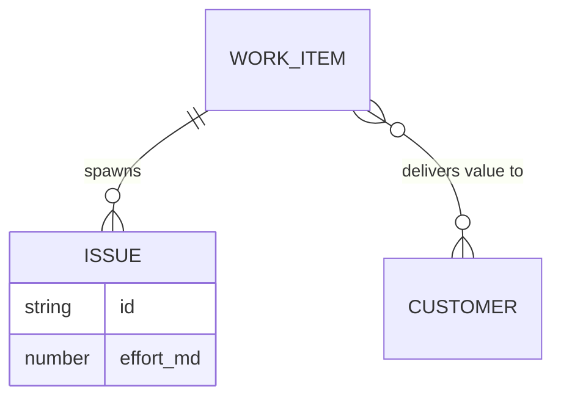

# Work Items (Scope Layer)

## Overview
Work Items (also referred to as Features) are strategic initiatives that connect customer demand to engineering execution. They represent the "What" of the product strategy.

## Data Model
```typescript
export interface WorkItem {
  id: string;
  name: string;
  description?: string; // Detailed context/requirements
  status: 'Backlog' | 'Planning' | 'Development' | 'Done';
  effort_size?: 'XS' | 'S' | 'M' | 'L' | 'XL' | null; // Baseline T-shirt estimate; absent/null = not estimated
  total_effort_mds: number; // Baseline MDs — server-derived from effort_size (0 when not estimated)
  score: number;            // Calculated RICE score
  stackrank?: number;       // Manual priority order (higher = higher priority); undefined = unranked
  customer_targets: {
    customer_id: string;
    tcv_type: 'existing' | 'potential';
    priority?: 'Must-have' | 'Should-have' | 'Nice-to-have';
    tcv_history_id?: string; // Reference to a specific historical TCV value
  }[];
  all_customers_target?: {
    tcv_type: 'existing' | 'potential';
    priority: 'Must-have' | 'Should-have' | 'Nice-to-have';
  };
  released_in_sprint_id?: string;
  created_at?: string;      // ISO 8601 — server-stamped once on first persist (immutable)
  updated_at?: string;      // ISO 8601 — server-refreshed on every persisted mutation
  origin?: 'local' | 'aha'; // Server-owned, derived from `links`; absent reads as 'local'
  links?: { aha?: ExternalLink | null }; // Links to external sources (see below)
}

export interface ExternalLink {
  external_id?: string; // Id in the source (Aha! feature id); set once synced; the stable match key
  key: string;          // Reference number (PROD-123); can change in the source
  url?: string;
  synced_at?: string;
  data?: { name?: string; description?: string /* HTML */; score?: number /* Product Value */;
           estimate_mds?: number /* informational only */; requirements?: {...}[] };
}
```

### Origin and Source-Owned Fields
A work item has exactly one **origin**: `local` (it exists only here, typically
engineering work) or the external source it is linked to. Aha! is the source of
truth for the PM-facing fields of work items that exist in Aha!.

- **Ownership.** A work item whose `links.aha` has an `external_id` (it was synced
  from an Aha! feature) has origin `aha`, even if it was created locally. A link
  with only a `key` (typed but not synced yet) stays `local`.
- **Server-owned.** The backend derives `origin` from `links` on every write
  (`backend/src/utils/workItemOrigin.ts`); a client-sent value is ignored. On the
  same writes it copies the owned fields from `links.<origin>.data`.
- **Owned fields** are read-only in the UI ("Managed in Aha!"). A PATCH that sets
  one to a value other than the source's is rejected with 400; when the same PATCH
  also sets `links`, the source's value wins.

| Field | Aha! item | Notes |
| ------------------ | -------------- | ------------------------------------------------------------------ |
| `name`             | From Aha!      | Feature name (copied only when non-empty).                         |
| `description`      | From Aha!      | Feature description, converted from HTML to plain text.            |
| Product Value      | From Aha!      | Read from `links.aha.data.score`.                                  |
| `parent_id`        | From Aha! (features in an epic) | The work item of the feature's Aha! epic; a feature without an epic keeps a local parent. See [AHA-INTEGRATION.md](AHA-INTEGRATION.md#epics-and-the-work-item-hierarchy). |
| `total_effort_mds` | Local          | Engineering data; Aha!'s estimate (`estimate_mds`) is informational. |
| Everything else    | Local          | Status, targets, stack rank, hierarchy, …                          |

- **Unlinking.** Deleting the Aha! link (`links: { aha: null }`) makes the item
  `local`. It keeps its current name and description, which become editable again.
- **Filtering.** `GET /api/data/workItems` accepts `origin` (`aha`, `local`, repeatable);
  `local` also matches items without an `origin` field. The Work Items list exposes
  it as the **Source** filter.
- **Legacy migration.** Older documents stored Aha! data in `aha_reference`,
  `aha_synced_data` and `aha_requirements`. They are migrated lazily when work items
  are read (`GET /api/data/workItems`, `GET /api/workspace`): the fields are moved
  onto `links.aha` (`total_effort_mds` becomes `estimate_mds`), the origin is
  derived, and the old fields are removed. The migration code is marked
  `TODO(remove)` and goes away once every record is migrated.

### Lifecycle Timestamps (`created_at` / `updated_at`)
`created_at` and `updated_at` are **server-owned** — clients never send them. The
backend stamps both on the initial insert and refreshes `updated_at` on every
subsequent POST replace or field-level PATCH (see `backend/src/routes/entity.ts`,
`TIMESTAMPED_COLLECTIONS`). Score recomputation writes only the `calculated_*`
fields via a separate `bulkWrite`, so it never bumps `updated_at`. These fields
exist to support later aging/cleanup of stale work items.

There is **no migration**. Legacy work items created before this feature are
backfilled lazily: on a work item's next update, if it has no `created_at` the
backend stamps one with the update time. This means `created_at` for pre-existing
items reflects when they were first touched after the feature shipped, **not**
their true creation time — an accepted approximation. `updated_at` is always
accurate from the first update onward.

## Prioritization Logic (RICE Score / ROI)
The score is calculated server-side in `backend/src/services/metricsService.ts`:
- **Formula:** `Score = Total Impact / Effort`.
- **Impact (Total TCV):** The contribution of a customer's TCV to a Work Item's Impact depends on the target priority:
    - **Must-have**: Contributes **100%** of the associated Customer TCV.
    - **Should-have**: Contributes a **shared portion** of the Customer TCV. Calculated as: `(Customer TCV) / (Total number of 'Should-have' Work Items for that particular Customer)`.
    - **Nice-to-have**: Contributes **0%** (does not add to the TCV/Impact).
- **Effort:** `calculated_effort`: the sum of the linked Jira issues' `effort_md` when that is above 0, otherwise the baseline `total_effort_mds` (see [Baseline Effort](#baseline-effort-t-shirt-sizes)).
- **Safety:** To avoid division by zero, the effective effort used in the calculation has a floor of 1 Man-Day. Reach and Confidence are currently implicitly 1.0.

### Historical Targeting
When targeting **Existing TCV**, a Work Item can be tied to a specific historical value using `tcv_history_id`. 
- If linked to history, the calculation uses that specific historical dollar value.
- If not linked (or linked to "Latest Actual"), it uses the customer's current `existing_tcv`.
- **Global Work Items:** Initiatives that target all customers (e.g., core maintenance) **always** use the latest actual TCV for their impact calculation.

```mermaid
graph LR
    TCV[Customer TCV (Actual or History)] --> Impact
    Impact --> Score
    Effort[Man-Days] --> Score
    Score --> Scaling[Visual Node Size]
```

## Manual Priority (Stack Rank)
The `stackrank` field is a manual integer ordering used alongside the calculated RICE score. **Higher numbers indicate higher priority** so a brand-new top-priority work item can simply take `max(stackrank) + 1` without ever needing negative values. The Work Items list view supports sorting by Stack Rank — unranked items always sort to the least-prioritized end (bottom on descending, top on ascending). The field is purely informational; it does not feed into the RICE calculation.

### Sparse spacing & inserting between items
New work items default to `max(stackrank) + 1000`, giving 1000-unit gaps between consecutive ranks. To insert an item between two neighbors, just type any integer in the gap (e.g. between 2000 and 3000, use 2500). Over time the gaps shrink. When that happens, the **Compact Ranks** button on the Work Items list page renumbers all currently-ranked items to clean multiples of 1000 (1000, 2000, 3000, …) preserving their existing order. Unranked items are left untouched.

## Baseline Effort (T-shirt Sizes)
A work item's baseline effort is a rough estimate for before engineering has
broken it into estimated Jira issues. It is set as a T-shirt size
(`effort_size`):

| Size | MDs |
| ---- | --- |
| XS   | 1   |
| S    | 10  |
| M    | 40  |
| L    | 120 |
| XL   | 360 |

- **Server-derived number.** On every write the backend sets
  `total_effort_mds` from the size (`backend/src/utils/effortSize.ts`), so effort,
  score, filters and sorting keep working on MDs. A write that sends only
  `total_effort_mds` (an older client) is converted to the nearest size.
- **Not estimated.** No size (absent or `null`) means 0 MDs: the item is flagged
  📏 and its score uses the 1 MD floor.
- **Jira override.** Once the linked Jira issues' efforts add up to more than 0,
  their sum is the effort and the size is ignored; the work item page says so.
- **Legacy conversion.** Numeric baselines from before sizes existed are converted
  lazily when work items are read (`GET /api/data/workItems`, `GET /api/workspace`):
  each goes to the nearest size on a log scale (boundaries are the geometric means
  of neighbouring sizes: ≈3.2, 20, 69, 208 MDs), `total_effort_mds` becomes that
  size's MDs, and scores are recomputed. 0 or missing stays not estimated. The
  code is marked `TODO(remove)`.

## Prioritization Toggle
Both the Work Items list and the ValueStream dashboard expose a single toggle (`prioritizationMetric`, stored on `ValueStreamViewState` and shared across the two views via `UIStateContext`) that selects which metric drives ordering and visual sizing:

| Mode | Field source | Notes |
| ------------- | ------------------------------ | ----------------------------------------------------------------------------------------------- |
| Score         | `calculated_score` (RICE)      | Default. Server provides the global `maxScore` for consistent sizing across filters.            |
| Product Value | `links.aha.data.score`         | Pulled from Aha! when a work item is linked to and synced with an Aha! feature. Items without sync data show "—". |
| Stack Rank    | `stackrank`                    | Higher value = higher priority. Unranked items sort to the bottom and show "—".                 |

In all modes higher value = higher priority (top of the list, biggest node). On the Work Items list, the toggle drives a single dynamic "Priority" column whose header label matches the active metric. The **Compact Ranks** action lives in the upper-right header and only appears when the toggle is set to Stack Rank, since it has no meaning otherwise.

## Visual Representation
- **Node Type:** `WorkItemNode`.
- **Scaling:** Size scales based on the active prioritization metric value relative to its maximum across the visible work-item set (or the server-provided `maxScore` in Score mode).
- **Tooltip:** Hovering over the node displays the `description`.
- **Status Icons:**
    - `📦`: Released (linked to a sprint).
    - `🕒`: Missing dates in connected Issues.
    - `📏`: Effort Not Estimated (0 MDs on item or any connected issue).
    - `🌐`: Global (targets all customers).

## Relationships
- **Customers:** Linked via `customer_targets`.
- **Issues:** One Work Item can spawn multiple Issues (execution units) across different Teams.
- **Hierarchy:** `parent_id` makes work items a tree. The list page's **Tree view** pages over top-level items and loads children on expand; with filters it keeps the ancestors of matches (greyed, "(parent)") so no match is hidden (`tree=true` on `GET /api/data/workItems`, see [API-REFERENCE.md](API-REFERENCE.md)). The dashboard's **Show Hierarchy** lays the work-item column out as the same tree (see [VALUESTREAMS.md](VALUESTREAMS.md)).


```mermaid
erDiagram
    WORK_ITEM ||--o{ ISSUE : "spawns"
    WORK_ITEM }o--o{ CUSTOMER : "delivers value to"
    ISSUE {
        string id
        number effort_md
    }
```

