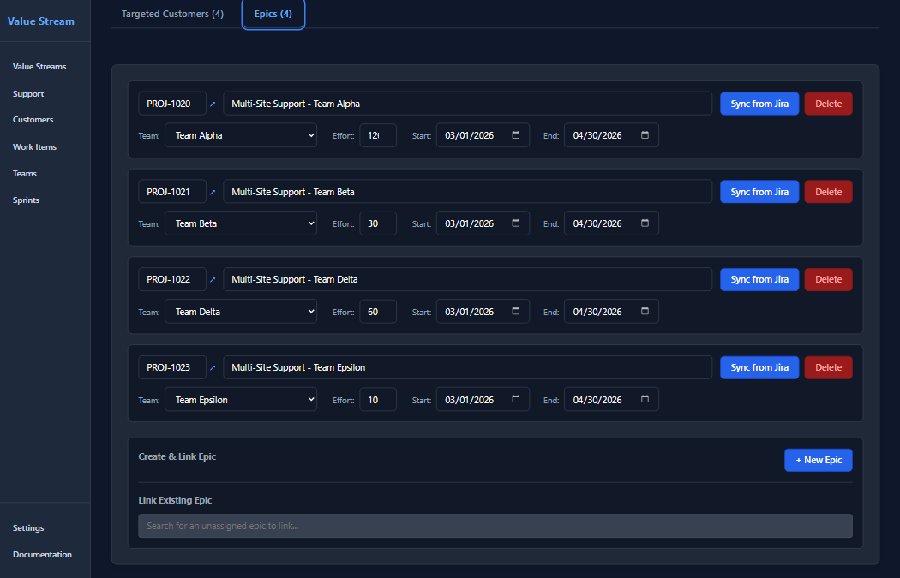
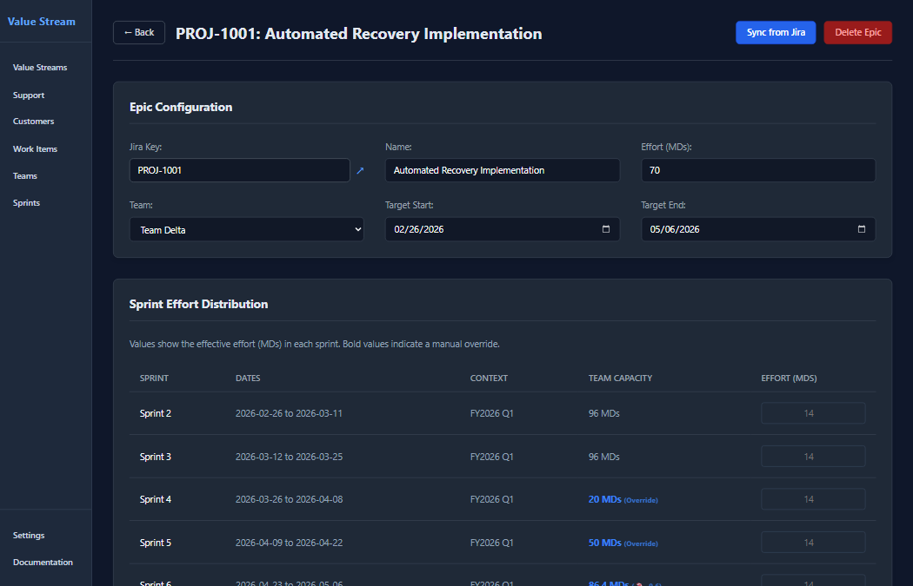
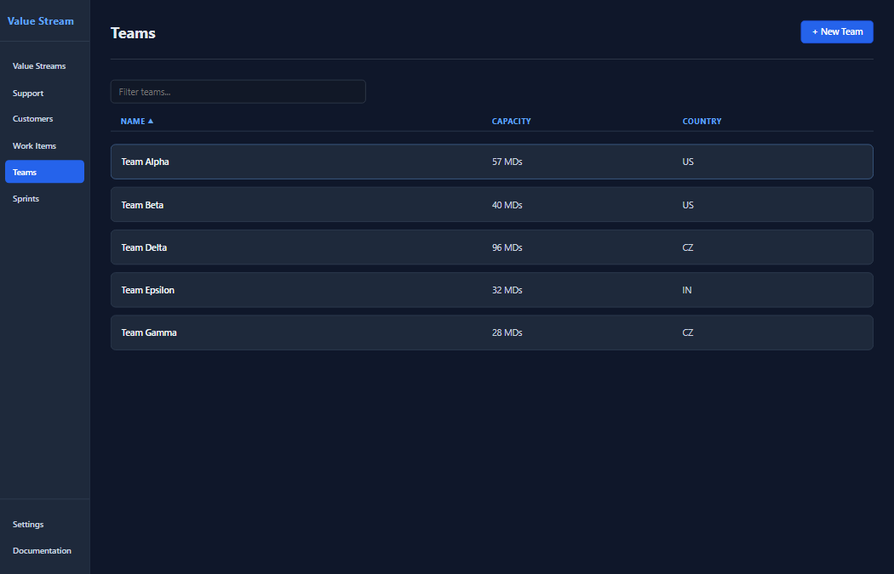

# 📖 User Guide & ValueStream Concepts

This guide provides a comprehensive overview of the ValueStream platform, organized by core entities, reporting capabilities, and system configuration.

---

## 1. Entities

Entities are the foundational data models that drive the system. Each entity has a dedicated list view for broad management and a detail view for granular control.

### 👤 Customers

Customers represent the accounts, segments, or contract entities that provide value (TCV) to the organization.

#### Customer List Page
The entry point for account management, providing a quick health check of the entire customer base.

**Details:**
*   **Intention:** High-level directory for financial impact assessment and account discovery.
*   **Visibility:** 
    *   **Name:** Customer identity.
    *   **Existing TCV:** Realized contract value currently active.
    *   **Potential TCV:** Pipeline value or targeted upsell opportunities.
*   **Actions:** 
    *   **Sorting:** Order the list by Name or TCV metrics to identify top accounts.
    *   **Filtering:** Instant-search across names to find specific accounts.
    *   **Navigation:** Click any row to enter the detailed account workspace.

#### Customer Detail & Lifecycle
The detail page is the command center for managing a specific account's lifecycle and alignment.

**Details:**
*   **Intention:** Precise management of contract states and strategic delivery.
*   **TCV Promotion Lifecycle:** The platform distinguishes between "Actual" (Existing) and "Target" (Potential) TCV. 
    *   **Action - "Promote to Actual":** This workflow moves the current Potential TCV into the Actual slot, while automatically snapshotting the old Actual value into the **TCV History** ledger. This ensures a clean audit trail as contracts evolve.
*   **Management Actions:** 
    *   **Update ID:** Set the internal Customer ID to enable automated MongoDB and Jira lookups.
    *   **Delete Customer:** Permanently remove the account and all its historical impact data from the workspace.

#### Management Tabs
The detail page uses a tabbed interface to organize complex data sets. Each tab is scrolled to reveal its specific management interface:

**Tab: Custom Fields**

*   **Intention:** Viewing bespoke customer data without duplicating it into the ValueStream database.
*   **Visibility:** Fetches real-time data from an external MongoDB collection using the Customer ID and the custom aggregation pipeline defined in Settings.
*   **Interaction:** View nested structures, product clusters, or status fields directly within the portal.

**Tab: Targeted Work Items**

*   **Intention:** Defining which strategic initiatives are fulfilling the customer's value.
*   **Actions:** 
    *   **Add Target:** Link a work item to this customer using the searchable dropdown.
    *   **Refine ROI:** Choose if the work impacts the **Existing** contract (defensive/retention) or **Potential** growth (offensive/upsell).
    *   **Historical Mapping:** For Existing TCV, link the work to a specific period from the TCV History.
    *   **Priority Alignment:** Set the delivery tier (Must-have, Should-have, Nice-to-have) which influences the overall RICE score.

**Tab: TCV History**

*   **Visibility:** An immutable, chronological audit trail created by the "Promote to Actual" lifecycle. Displays past values, start dates, and contract durations.
*   **Actions:** Manually remove historical entries if necessary.

**Tab: Support Health**

*   **Intention:** Real-time risk monitoring for the account.
*   **Manual Tracking:** Add localized support issues with descriptions, statuses, and expiration dates.
*   **Jira Integration:** Automatically sync tickets from Jira matching the customer's JQL, categorized into **New / Untriaged**, **Active Work**, and **Blocked / Pending**.
*   **Link Status:** Discovered Jira tickets can be linked to manual Support Issues to provide a unified view of account health.

---

### 🚀 Work Items

Work Items represent strategic initiatives, major feature sets, or roadmap themes.

#### Work Item List Page
A prioritization dashboard for the product organization.

**Details:**
*   **Intention:** ROI-driven prioritization using the RICE framework.
*   **Visibility:** 
    *   **RICE Score:** Calculated based on (TCV Impact / Effort).
    *   **Effort (MDs):** Total man-days required, rolling up from connected Epics.
    *   **Release Target:** The specific sprint where this item is delivered.
*   **Actions:** Sort the list to identify high-value opportunities.

#### Work Item Scope & Execution
Define the "What" and the "How" of a strategic goal.

**Details:**
*   **Actions:** 
    *   **Define Impact:** Toggle the **"Global"** flag if the item benefits every customer in the system (e.g., tech debt).
    *   **Set Score Components:** Adjust manual effort estimates if no epics are yet defined.
    *   **Delete:** Remove the work item and detach all associated epics.

**Tab: Targeted Customers**

*   **Actions:** Define exactly which high-value accounts this initiative is for. Choose the TCV type for each account to drive the automatic RICE score calculation.

**Tab: Epics & Engineering**

*   **Intention:** Breaking down strategy into deliverable technical units.
*   **Actions:** 
    *   **Epic Linkage:** Add Epics and assign them to specific Engineering Teams.
    *   **Estimate Roll-up:** Set individual Man-Day estimates for each Epic. The Work Item's total effort is automatically updated as the sum of its Epics.

---

### 📦 Epics

The granular execution units that bridge Product strategy and Engineering delivery.

#### Epic Detail View

**Details:**
*   **Jira Sync:** Link a Jira Key to pull real-time Status, Summary, and Effort estimates directly.
*   **Gantt Control:** Set Target Start/End dates. If these are missing, the epic will show a 🕒 warning icon in the Value Stream.

---

### 👥 Teams & Capacity

Engineering teams are the delivery engines, each with a defined velocity.

#### Team List Overview

#### Team Detail & Capacity Management

**Details:**
*   **Baseline Capacity:** Set the default MDs per sprint.
*   **Dynamic Overrides:** Click any sprint in the capacity list to set a manual override (e.g., for holidays). Overridden values are marked with a 🔒 icon on the timeline.

---

### 📅 Sprints

The temporal framework that aligns the organization.

**Details:**
*   **Intention:** Maintaining a continuous, gap-free delivery timeline.
*   **Actions:** **"+ Create Next Sprint"** automatically sets the correct start date based on the duration of the previous sprint.

---

## 2. Reports

Reports provide the visualization and analysis layer to make sense of the underlying data.

### 🗺️ The Interactive Value Stream

The platform's primary visualization, mapping value from source to delivery.

#### Value Stream Scopes

#### The Live Graph Visualization

**Details:**
*   **Visualization Logic:** 
    *   **Dual-Layer Circles:** Customers show "Actual TCV" (Inner) and "Total Potential" (Outer Ring).
    *   **Dependency Tracing:** Hover any node to dim the rest of the graph and highlight direct upstream/downstream paths.
*   **Control Panel:** 
    *   **Sprint Offset:** Use the **"< Sprints >"** buttons to slide the 6-sprint Gantt window across the timeline.
    *   **Reset View:** Instantly center the timeline on the active sprint.
*   **Filtering & Thresholds:**
    *   **Multi-Column Search:** Filter nodes in any column (Customers, Work Items, Teams, Epics).
    *   **Release Filter:** Filter by **Released**, **Unreleased**, or **All** items.
    *   **Metrics Thresholds:** Set minimum **TCV ($)** or **RICE Score** to hide low-impact items.
*   **Interaction:** 
    *   **Right-Click (Filter & Reposition):** Isolate a node's specific dependency tree. The system hides all unrelated nodes and collapses empty space to focus on that item's delivery path.

---

### 🏥 Support Health

A bird's-eye view of account stability and risks across all customers.

**Details:**
*   **Intention:** Identifying "At-Risk" revenue through support trends.
*   **Ranking Logic:** Issues are sorted by the **Customer's TCV Rank** (💰 markers), prioritizing high-revenue accounts.
*   **Activity Monitoring:** Tags like "New" or "Updated" highlight items requiring immediate attention.

---

## 3. Settings & System

Configuration and security parameters that govern the platform.

### ⚙️ System Configuration

**Details:**
*   **Persistence:** 
    *   **MongoDB:** Supports multiple authentication methods (SCRAM, AWS IAM, OIDC) and connection testing.
    *   **Portability:** Perform full workspace **Export** to JSON or **Import** to restore from a backup.
*   **Jira Integration:** Configure JQL templates for automated ticket discovery.
*   **AI Settings (Optional):** Configure LLM providers (OpenAI, Gemini, Anthropic) for potential future enhancements.
*   **Security:** Masking for sensitive credentials and session-based `ADMIN_SECRET` protection.
