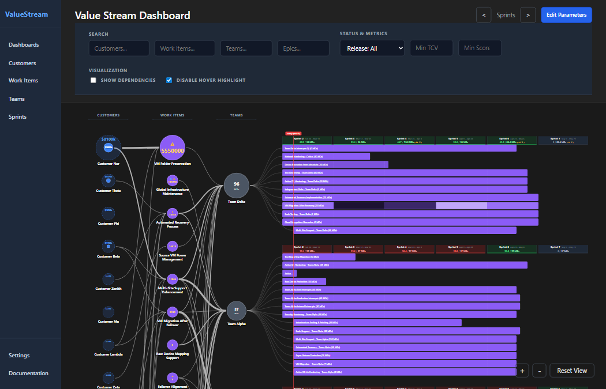
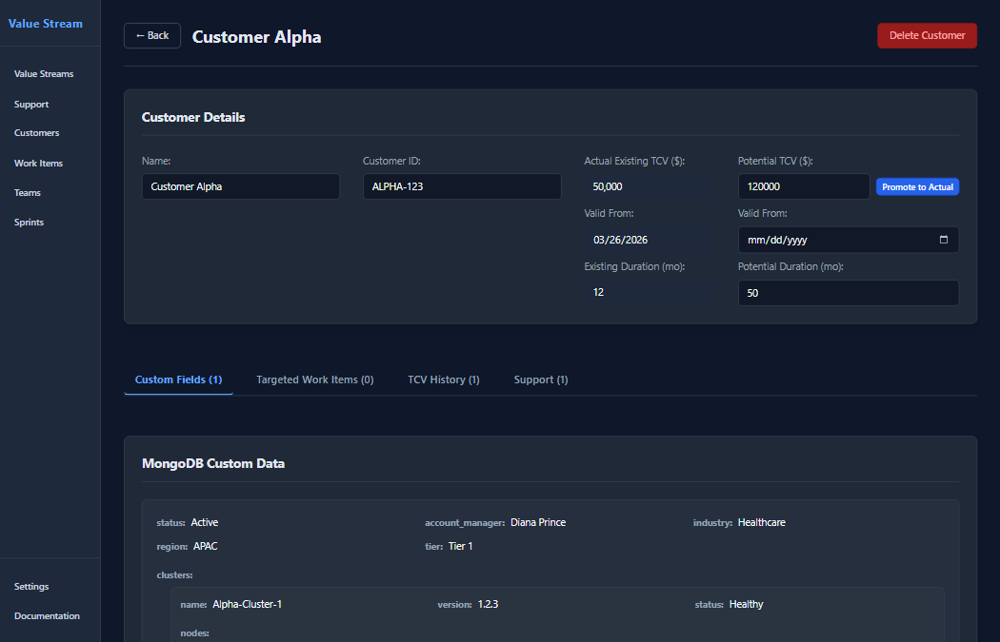
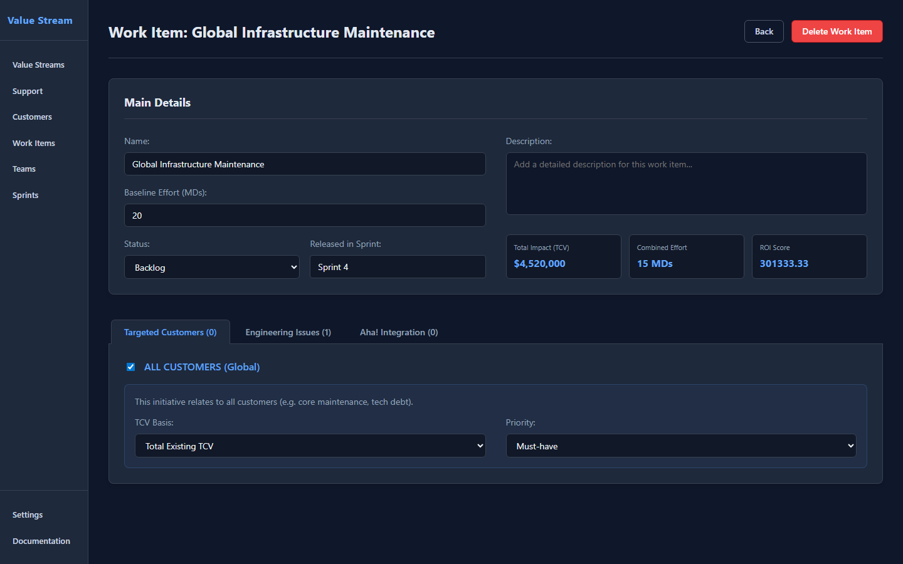

# 📖 User Guide & Value Stream Concepts

### 1. The Interactive Dashboard

The main view provides a high-level map of value flow from Customers to Teams.
- **Column Structure:** The dashboard is organized into three primary columns: **Customers**, **Work Items**, and **Teams**, followed by the **Gantt Timeline**.
- **Unified Visual Identity:** All buttons and input fields across the application share a consistent visual style. Primary actions are blue, while destructive actions (Delete/Remove) are red.
- **High-Performance Filtering:** The header contains a streamlined filter bar organized into logic groups. Filtering is now integrated with the database, allowing for lightning-fast searches even on large datasets.
    - **Search:** Quickly filter any column by typing names or partial strings.
    - **Status & Metrics:** Toggle visibility based on **Release Status** or set thresholds for **Min TCV** and **Min Score**.
    - **Background Updates:** When you change a filter, the dashboard stays visible while it fetches updated data. A small circular spinner appears in the top header during these background updates.
    - **Debounced Input:** Text fields wait briefly after you stop typing before refreshing, making it easy to enter long names without the screen jumping.
- **Persistent Custom Dashboards:** You can create multiple named dashboards with specific filter parameters.
    - **Edit Parameters:** Click the **"Edit Parameters"** button in the top-right corner of any dashboard to adjust its permanent filters, including **name**, **description**, and **structural filters**.
    - **Sprint Range Filter:** Dashboards can be limited to a specific range of sprints. Only items connected to epics that fall within this time range will be displayed.
- **Enhanced Highlighting:** By default, hover-based highlighting is disabled to reduce visual noise. You can toggle this on/off using the **"Disable Hover Highlight"** checkbox.
- **Dependency Tracing:** When highlighting is enabled (or via right-click), hovering over any node dims the rest of the graph and illuminates its direct upstream and downstream dependencies.
- **Structural Filtering (Right-Click):** Right-click any node to **Filter and Reposition** the graph. This isolates just the dependency tree of that node and collapses empty space. Right-click again to clear the filter.
- **Reset View:** Clicking **"Reset View"** in the bottom-right corner perfectly frames the dashboard, top-aligning the column headers and centering the Gantt chart on the **Active Sprint**.

### 2. Customer TCV Visualization
Customers are represented by dual-layer additive circles:
- **Inner Circle (Solid Blue):** Represents **Existing TCV** (realized value).
- **Outer Ring (Dashed Blue):** Represents **Total TCV** (Existing + Potential).
- **The Gap:** The distance between the solid core and the dashed ring visually represents the "Potential Upside" still available for that customer.
- **Proportional Scaling:** Circle diameters are strictly proportional to the global maximum TCV, making it easy to spot your most valuable accounts at a glance.
- **Focus Effects:** All input fields provide a subtle blue glow when focused, ensuring you always know which field you are currently editing.

### 3. Customer & Work Item Detail Pages
Both Customers and Work Items feature tabbed detail pages for better organization:

#### Customer Detail Page

- **Customer Details Section:** Displays basic info like Name, Actual TCV, and Potential TCV.
- **Updating Actual TCV:** The "Actual Existing TCV" value is protected. To change it, click **"Update TCV"**. This triggers a lifecycle process:
    1. The current value and its "Valid From" date are moved into the history.
    2. You enter a new value and a new date from which it becomes the "Actual" state.
- **Tabs:**
    - **Targeted Work Items:** View and manage which strategic initiatives are delivering value to this customer.
    - **TCV History:** A chronological audit trail of the customer's contract evolution. Historical entries are created automatically whenever you perform an "Update TCV" action.

#### Work Item Detail Page

- **Work Item Details Section:** Edit the name, total man-day estimates, and release target.
- **Tabs:**
    - **Targeted Customers:** Define which customers this initiative benefits. You can target either the **"Latest Actual"** TCV or a specific **historical record** from the customer's timeline.
    - **Epics:** Manage the execution units (Epics) assigned to engineering teams that fulfill this work item.

### 4. Work Item & Team Management
- **Labels:** To maximize legibility, all node names are placed **below the circles** in a large, bold font. Circles are reserved for core numerical metrics (TCV, RICE Score, or Capacity).
- **Searchable Assignments:** All dropdown menus for linking entities (e.g., adding a Customer Target to a Work Item) are **Searchable**. Simply type a few letters to filter the options.
- **Node Status Icons:** Work Items display status indicators in the top-right of their circle:
    - **📦 Released:** Marked when a Work Item is associated with a specific release sprint.
    - **⚠️ Missing Dates:** Displays when a Work Item has connected Epics that are missing target start or end dates (meaning they cannot be visualized on the Gantt chart).     
    - **🌐 Global:** Marked when a Work Item is designated to impact **ALL Customers** simultaneously.
- **Global Work Items (Maintenance/Tech Debt):**
    - **Configuration:** In the Work Item detail page, check the **"ALL CUSTOMERS (Global)"** row at the top of the target table.
    - **TCV Basis:** You can choose whether the item's impact is calculated based on total **Existing TCV** or **Potential TCV** across the entire system.
- **Score Calculation:** Work Items use a RICE-based score that scales visually. The number inside the purple circle is the calculated priority score. For global items, the impact is the sum of relevant TCV across all existing customers.
- **Team Capacity:** Team circles show their base capacity in Man-Days (MDs). If a team is over-allocated in a specific sprint, the capacity marker above their Gantt lane will turn red.

### 5. Progress-Aware Gantt Timeline
The Gantt chart distinguishes between what has happened and what is planned:
- **Historical Actuals (Steel Blue + Stripes):** Segments in sprints older than the active one are **frozen**. They represent effort already spent and are snapshotted into a permanent "Actuals" ledger.
- **Future Plan (Vibrant Purple):** Segments in the active and future sprints are **dynamic**. Their intensity shifts in real-time as you move dates or change estimates.
- **Effort Intensity:** In both colors, the brightness of a segment indicates the volume of work allocated to that specific sprint.
- **Safety Prompts:** If you attempt to shift the **Start Date** of an Epic that has recorded historical work, the app will prompt you to confirm if you want to "unthaw" and overwrite those records.

### 6. Sprint Management & Continuity
The dashboard ensures a continuous, unbroken timeline through strict schedule management: 
- **Access:** Left-click any **Sprint Header** (the capacity markers above the Gantt lanes) to open the Sprint Management page.
- **Inline Editing:** To rename a sprint, simply click its header to enter the management page. The selected sprint will be highlighted and editable directly in the schedule table.
- **Schedule Integrity:**
    - **Date Locking:** Start and end dates are managed automatically to ensure no gaps or overlaps exist in your timeline. They are read-only for existing sprints.
    - **Deletion Protection:** To prevent orphaning data, only the **last sprint** in the schedule can be deleted. Earlier sprints are "Locked" to preserve the historical sequence.
- **Timeline Expansion:** Click **"+ Create Next Sprint"** at the bottom of the table to add a new 14-day block. The system automatically calculates the next logical dates and name.

### 7. Settings & Integration
Use the ⚙️ **Settings** modal or the dedicated **Settings** page to configure the application behavior.

- **Time & Fiscal Calendar:**
    - **Fiscal Year Start:** Define which month your fiscal year begins (e.g., April). The application will automatically group and label sprints into fiscal quarters (FY2026 Q1, etc.) on the Sprint Management page.
    - **Default Sprint Duration:** Set the default number of days for new sprints. This ensures consistency when expanding your timeline.
- **Native Jira Epic Synchronization:**
    - **Configuration:** Set your **Jira Base URL** and **API Token** in the integration settings.
    - **Customer Issue Tracking:** Define custom JQL queries to automatically identify and track specific issue types linked to customers.
    - **Bulk Import/Sync:** The settings page provides unified tools to **Sync All Epics from Jira** or **Import Epics via JQL** to quickly hydrate your dashboard from Atlassian data.
    - **Epic Proxy Sync:** Inside any individual Epic's detail page, the **"Sync from Jira"** button pulls the latest Summary, Estimates, Dates, and Team assignments.

### 8. Persistence & Collaboration
- **Storage:** The application uses MongoDB for persistence, with a fallback to `staticImport.json` for lightweight or portable environments.
- **Auto-Snapshot:** When a sprint ends, the system automatically snapshots the calculated effort into permanent overrides, preserving your delivery history.
- **Save Changes:** Click the blue **"Save Changes"** button in the header to write all layout adjustments and node edits back to the central data store.
- **Data Export:** On the Settings page, you can export your entire current project state as a `staticImport.json` file for local backup or sharing with other team members.